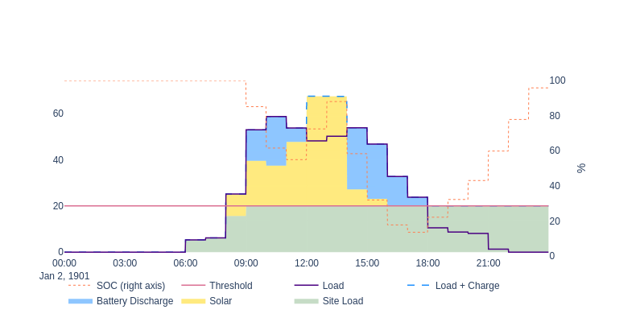
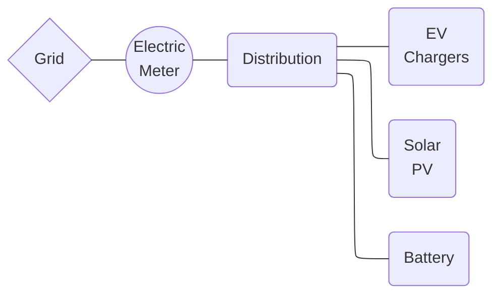
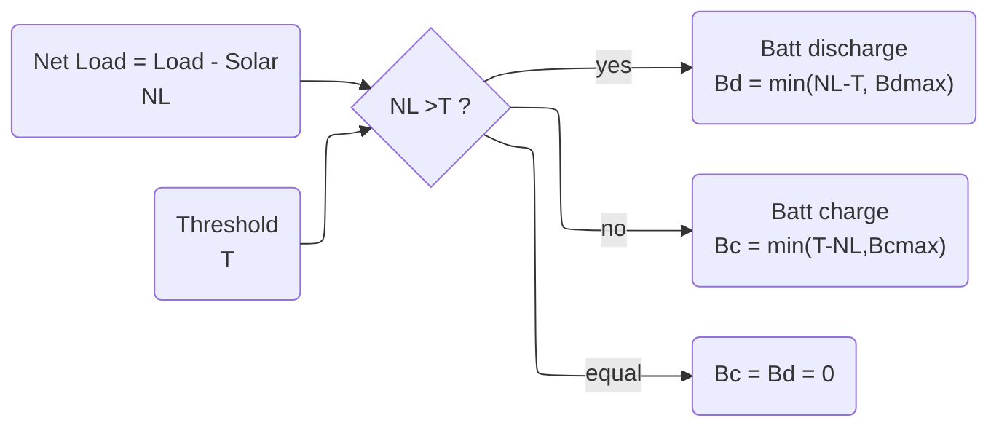
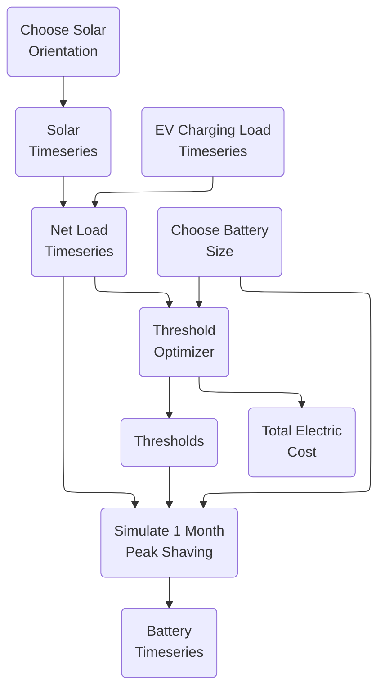

# Abstract

--

# Introduction

## Why peak load

The renewable energy transition will oversee a global shift toward electric energy consumption and renewable electric energy production in the coming decades. Since most electric transmission and distribution networks were previously built slowly over the span of many decades, electric load growth will almost definitely outpace network upgrades. And where these upgrades are completed they are necessarily an additional cost paid by all electricity consumers, due to the decrease in the load factor. Furthermore in some markets where companies can own both generation and distribution, business-as-usual infrastructure upgrades may be prioritized over the new construction of more complex and financially risky renewable generators. So while there are some creative solutions around dynamic capacity limits, two important solution areas for overall deployment speed, cost effectiveness, and overall decarbonization goals are (a) more local energy production and (b) increasing the load factor.

Electric vehicle (EV) charging and electric heating and cooling, including traditional air conditioning and heat pumps, are two common new loads that will strain networks in most countries. Heat pump and air conditioning load factor may be increased with architectural features such as insulation and thermal storage, but building retrofits are often slowed down due to permitting and other challenges. Meanwhile extreme weather events, especially heat waves, will likely further reduce the load factor of these devices. Many EV users will choose to slowly charge overnight at home for convenience and to minimize their energy cost. However workplace, fleet, and public EV charging stations will likely still be required, and these may especially suffer from a low load factor due to the convenience or need of fast charging at high power. 

## Peak shaving

Peak load management, or peak shaving, essentially requires choosing a power threshold and holding the load power below it. Controllable loads, energy storage, or generation assets behind the billing meter can all be used to reduce the load power to the threshold power. The threshold may only apply for only certain time periods. There may be multiple thresholds and periods each day, month, or year. There are two general cases of peak shaving worth considering. The most generation formulation of peak shaving control is formulated in Equation 1.
$$
\begin{equation}
\begin{split}
I_{threshold,t} &> I_{j,t} - \Sigma_i I_{gen,i,t} - \Sigma_j I_{gen\uarr,j,t} - \Sigma_k I_{load\darr,k,t}  \\
\\
&\text{where:} \\
&i\text{ is generation asset with no flexibility} \\
&j\text{ is generation asset with upward flexibility} \\
&k\text{ is controllable load asset with downward flexibility} \\
&t\text{ is relevant timesteps}
\end{split}
\end{equation}
$$

Here we consider the case of no controllable load, a single battery, solar which reduces the site load, and all values in units of average real power over the interval $\Delta h = 1\ hour$. 
$$
\begin{equation}
\begin{split}
P_{threshold,h} &> P_{load,h} - P_{solar,h} - P_{batt,discharge,h} + P_{batt,charge,h}   \\
P_{batt,discharge,h} &\ge 0 \\
P_{batt,charge,h} &\le 0 \\
h &\in \{0,1,2,...23\} \\
\end{split}
\end{equation}
$$

### Technical

Technical peak shaving refers to the case where a load must operate under a technical limitation such as a maximum power agreement or distribution transformer size. The load power must remain under the threshold at all times, otherwise there may be a technical failure such an activated overcurrent protection. Even if the load is technically able to rise above the threshold, doing so may violate a contract regarding maximum load power. The important consideration is that the economic cost of failure to hold the load under the threshold is prohibitively high. The time resolution of technical peak shaving control and modeling may need to be as low as seconds or milliseconds. Although this may be a challenging problem if the current limit is dynamically set or if a larger network is considered, from the perspective of dispatching the assets to shave the peak the problem is a relatively simple one: economic dispatch such that the the load current remains below the threshold current. Technical peak shaving might be performed on current or apparent power rather than active power.

> *Figure A: The threshold is 20 kW. The battery begins the day full at 100 kWh. By 8:00 the load has increased above the threshold to 25 kW, but solar has also increased to 9 kW, so the site load is still below the threshold. However at 9:00 the battery must discharge at 13 kW to reduce to site load to 20 kW. At 12:00 the battery can recharge somewhat due to an increase in solar and slight decrease in load. Then by 18:00 the load is less than the threshold and the battery can recharge, increasing the site load up to the threshold.*

An example of technical peak shaving with a threshold of 20 kW is seen in Figure A. The actual load climbs well above the threshold, but the solar energy for that day reduces the site load considerably. Battery discharge is required in the morning and afternoon to keep the site load below the threshold, with some opportunistic midday charging. The battery recharges in the evening and overnight.   

### Economic

Rather, economic peak shaving aims to reduce what a consumer pays for power and possibly also energy. Medium and large electric consumers often pay a price on energy (€$/kWh$) and a price on power (€$/kWh_{peak}$), or demand charge. The energy cost (€$/kWh \times E_{consumed}$) may vary with time of day, day of week, and season of the year, which is often referred to as time of use or peak pricing. Where there is a sufficient spread between the peak and off-peak prices there may be the opportunity to curtail load during high prices, use controllable loads to shift from a high price period to a lower one, or to use energy storage to buy energy at the lower price and reduce load during a higher price period. A peak shaving approach applied to the energy cost could be effective and maybe even advantageous. However there are several key differences between an energy based approach and a power one, where peak shaving is better suited for the latter.

Instead, the power cost (€$/kW \times P_{max}$ ) typically applies to the max power during the billing period, where the peak power is the maximum non-moving average in a given period (e.g. 12:00-18:00 on weekdays) calculated on a given interval (e.g. 60 minutes). Similar to the energy cost, there may be multiple time of use periods and associated prices, such as peak, mid-peak, and off-peak. And where the spread price is sufficiently high, the period peak can be reduced with load curtailment or rescheduling, distributed generation such as solar, or energy storage.     

> *Figure B: The threshold is comprised of two parts: Threshold0 at 20 kW from 12:00-18:00, and Threshold1 at 40 kW from 9:00-12:00 and 18:00-21:00. The battery begins the day full at 100 kWh. By 9:00 the load has increased above Threshold0, solar decreases this greatly, and the battery is discharged to further reduce the site load. However at 9:00 the battery must discharge at 13 kW to reduce to site load to 20 kW. At 11:00 and 12:00 the battery can recharge somewhat due to an increase in solar and slight decrease in load. Then by 18:00 the load is significantly less than the threshold and the battery can recharge, increasing the site load up to the threshold.*

Solar contributes significantly to the load, but once the peak period begins the battery must discharge to keep the 

| Feature                         | Technical Peak Shaving | Economic Peak Shaving          |
| ------------------------------- | ---------------------- | ------------------------------ |
| Cost of violating the threshold | Prohibitively high     | Depends on tariff              |
| Averaging interval              | << 1 minute            | 15 minutes or 1 hour (typical) |
| Valid times of day              | All                    | Limited (e.g. 16:00 to 21:00)  |
| Peak is reset every..           | Never                  | Month, year, day (typical)     |

# Methodology

> *Figure E: Simplified one-line schematic of the simulated EV charging station with true measured EV charging power, modelled on-site solar PV generation, and a modelled stationary battery for economic peak shaving.*

The methodology of this study is a set of offline simulations involving (a) EV charging power measurements, (b) modelled solar PV production power, and (b) AC-coupled battery dispatch, all behind the retail electric meter. In each simulation the battery power is chosen such that the net load (natural load less solar production) is held below a given threshold, which is optimally chosen by a gradient descent optimizer. The optimal threshold changes for each TOU period. A single simulation is defined for one solar configuration and battery capacity and lasts one calendar month, which is the shortest period for which the cost function is defined. Simulations are repeated for several months of data, and many different solar and battery design sizes, allowing for a retail energy cost comparison among different design scenarios. EV charging power or solar are never curtailed. The primary decision variables in each timestep are (a) battery charge or discharge, and (b) battery power.

## Data

### EV Charging Load

The measured EV charging power ("load") is from the Caltech Adaptive Charging Network database at the JPL site. Each charging session provides timeseries active power, averaged over a 10 second interval. In the cases when complete timeseries data is not available for a session, the charging profile is estimated and the total charging energy delivered is the same. The disaggrated session timeseries data is summed into a single timeseries of total site charging power, which is then averaged over 15-minute intervals. Timestamp indices refer to the beginning of the 15-minute interval. The data period is from 2018-5-1 00:00 to 2019-2-28 23:45.

### Solar Production

The modelled PV production power begins life as GOES satellite solar irradiance data from the US National Solar Resource Database (NSRDB), and is specific to the exact time and date rather as opposed to typical meteorological year data. Prism Solar 350 W bifacial solar module DC electrical power is estimated using the California Energy Commission Performance Model, a 6-parameter physical PV cell model. The full AC array power is estimated given loss assumptions and an inverter efficiency lookup table in the NREL SAM database for the Enphase IQH 380 W microinverter. All these functions are implemented in SAM v2022.11.21 (Gilman 2015). 

Three different solar array orientations are modelled and simulated in different case studies. Each orientation has the same number and type of modules: all modules facing South at 20° tilt, all modules facing West at 90° tilt, and half the modules facing South at 20° tilt and half the modules facing West at 90° tilt. Tilt is defined as 90° minus the altitude angle of the normal vector of the primary active face of the module. No shading is considered. Of the two sides of the bi-facial module, the primary active face is oriented West since afternoon load is generally subject to higher prices.

| Timeseries Description             | Location                                | Type                                                         | Interval / Length                                  | Source            |
| ---------------------------------- | --------------------------------------- | ------------------------------------------------------------ | -------------------------------------------------- | ----------------- |
| EV charging power ($kW_{ac}$) | Jet Propulsion Lab, Pasadena CA, USA    | Measured and aggregated from multiple EV chargers at single site | 10 sec (average downsampled to 15 min) / 10 months | Caltech ACN       |
| Solar irradiance  ($W/m^2$)   | GPS: 34.2013, -118.1721 (2x2 km square) | GOES satellite irradiance                                    | 5 minute / 10 months                               | NSRDB PSMv3       |
| PV array production  ($kW_{ac}$)   | GPS: 34.2013, -118.1721 (2x2 km square) | Modelled from satellite irradiance, 368 Prism Solar 350 W bifacial modules, 368 Enphase IQH 380 W microinverters | 15 minute / 10 months                              | SAM (Gilman 2015) |

> *Table C: Timeseries Data Summary. EV charging power is measured every 10 seconds for 10 months at the Jet Propulsion Laboratory, CA, USA. Solar irradiance from the GOES satellite is acquired for the same location. Solar PV array production is modelled from the satellite irradiance using a 6 parameter PV cell model and inverter efficiency lookup table.*

## Battery

A stationary, storage battery system is simulated as the primary decision variable in the peak shaving algorithm. In each timestep the battery is chosen to charge or discharge within its technical limits. Because the control action is to hold the power exchange with the grid to below a certain threshold, batteries with a larger power capacity or energy capacity will necessarily achieve a lower threshold if the entire battery capacity is used. For a given energy capacity ($kWh$) those limits are a charge or discharge rate no more than 1C and SOC between 0 and 100% of rate. Charge and discharge efficiency is assumed constant and no self discharge or thermal limiting are considered.

There are many strategies for optimal battery sizing, but the emphasis in this work is instead on understanding the dynamics between load, shape of the solar curve, and peak shaving algorithm for a given battery size. Therefore a sensitivity analysis is performed on the battery energy capacity, but no one battery size is declared economically optimal.

| Battery Sizes (kWh)                      |
| ---------------------------------------- |
| 25, 50, 75, 100, 125, 150, 200, 400, 600 |

> *Table A: Vector of battery sizes chosen for peak shaving simulations. These were identified as interesting values experimentally.*

Each simulation assumed charge and discharge rate are limited to 1C, usable SOC is assumed 100%, and self discharge, parasitic losses, and thermal limiting are not considered.

## Electric Tariff

A typical California electric tariff is applied at the point of the retail electric meter, with several different TOU periods and prices. For the chosen tariff each TOU period may have an energy price ($\$/kWh$), a power price ($\$/kW$), or both. The prices may also change between seasons, and have long term trends like any retail electric prices. Here a price on power ("demand charge") is understood as a $\$/kW$ price applied to the monthly maximum power observed at the meter, calculated as the 15-minute average of real power. 

| Name            | TOU Period                            | Summer (Jun 1 - Sept 30) [\$] | Winter (Oct 1 - Feb 28) [\$] | Spring (Mar 1 - May 30) [\$] |
| --------------- | ------------------------------------- | ---------------------------- | --------------------------- | --------------------------- |
| All hours       | 0:00-0:00                             | 26.07 / kW                   | 26.07 / kW                  | 26.07 / kW                  |
| Super off-peak  | 9:00-14:00                            | --                           | --                          | 0.079 / kWh                 |
| Off-peak spring | 0:00-9:00, 14:00-16:00, 21:00-0:00 | --                           | --                          | 0.132 / kWh                 |
| Off-peak winter | 0:00-16:00, 21:00-0:00                | --                           | 0.132 / kWh                 | --                          |
| Off-peak summer | 0:00-14:00, 23:00-0:00                | 0.132 / kWh                  | --                          | --                          |
| Partial-peak    | 14:00-16:00, 21:00-23:00              | 6.81 / kW, 0.159 / kWh  | --                          | --                          |
| Peak            | 16:00-21:00                           | 32.90 / kW, 0.196 / kWh | 2.22 / kW, 0.172 / kWh | 2.22 / kW ,0.172 / kWh |

> *Table B: Retail Electric Tariff. An applicable electric tariff schedule with seven different TOU periods for energy and power prices, varying by hours of the day and season of the year. From California PG&E.*

The total retail electric cost $C$ for each month is then the sum of the energy cost and power cost for the month, where the energy and power costs are calculated separately for each TOU period. The energy cost is the energy delivered to the site multiplied by the energy price for that TOU period. The power cost is the maximum 15-minute average power for the month multiplied by the power price for that TOU period. Only positive values of site load $SL$ are used in the cost calculation since the monthly peak power for each TOU period must always be positive and necessarily cannot benefit from net metering (export to the grid).

$$
\begin{equation}
\begin{split}
B(t) &= B_d(t) - B_c(t) \\
NL(t) &= L(t) - S(t) \\
SL(t) &= L(t) - S(t) - B(t) = NL(t) - B(t)\\
SL^+(t) &= SL(t),\ \forall\ SL(t)>0\\
C_m &= \Sigma_k^K [ p_{p,k,m} max(SL^+_{k,m}) + p_{e,k,m} \Sigma (SL^+_{k,m}) ] \\
\\
& \text{where:} \\
&L \text{ is EV charging load}\ [kW] \\
&S \text{ is solar production}\ [kW]\\
&NL \text{ is net load}\ [kW] \\
&SL \text{ is site load, measured at the retail electric meter}\ [kW] \\
&B_c \text{ is battery charging power (non-negative)}\ [kW] \\
&B_d \text{ is battery discharging power (non-negative)}\ [kW] \\
&C_m \text{ is total retail electric cost for month}\ m\ [\$] \\
&p_{p,k,m} \text{ is power price for TOU period}\ k\ \text{and month}\ m\  [\$/kW] \\
&p_{e,k,m} \text{ is energy price for TOU period}\ k\ \text{and month}\ m\ [\$/kWh] \\
&K \text{ is number of TOU periods}
\end{split}
\end{equation}
$$

## Peak Shaving Algorithm

An optimal peak shaving strategy is used to minimized the total retail electric cost to the EV charging station. The strategy is operational only, and assumes the solar production timeseries and battery capacity are fixed. The state variable controlled by the algorithm is battery charge or discharge power. However the algorithm reframes the problem as one of choosing a power threshold $T\ (kW)$ applied to the point of injection to the grid, the electric meter. The battery is then dispatched, within its technical limits, to hold the net load (natural load less solar production) below the threshold. When the algorithm is successful the different thresholds for each TOU period are met for an entire month. If the battery reaches a technical limit and net load exceeds a threshold, the simulation is not necessarily invalid but is not likely to minimize the retail electric cost to the site for that combination of solar and battery size. The peak shaving logic is described in Figure D. 

> *Figure D: Peak shaving dispatch. Net load is the timeseries of load less solar. There is one threshold value for one for each TOU period with a non-zero power price. For each timestep of the simulation the net load is compared to the threshold of that TOU period, and the battery is discharged if the net load is greater than the threshold and charged if the net load is less than the threshold. If the two are equal the battery does nothing. For timesteps with no price on power the the battery does nothing.*

The peak shaving algorithm describes stepping through time and dispatching the battery according to power thresholds, but not how the thresholds are chosen. 

## Threshold Optimizer

The optimal demand thresholds (one per TOU period) are determined by a custom gradient descent optimizer. The objective function $C$ minimizes the retail energy cost of one month, which is the billing interval of this retail electric tariff. In practice the optimal thresholds are different for each month. The threshold for each TOU period $T_k$ is not enforced to be non-negative, but in practice is always is because the cost function $C_m()$ cannot evaluate to a negative value.

$$
\begin{equation}
\begin{split}
min[C_m(B_c,B_d)] & = min[C_m(T_1,T_2,..T_K)] \\
& s.t. \\
B_c(t) & \le B_{c,max} \\
B_d(t) & \le B_{d,max} \\
SOC_{min} & \le SOC(t) \le SOC_{max} \\
\\
& \text{where:} \\
B_c & \text{ is battery charge power timeseries}\ [kW] \\
B_d & \text{ is battery discharge power timeseries}\ [kW] \\
T_k & \text{ is threshold for}\ k\text{-th TOU period of}\ K\ \text{total periods} \\
SOC & \text{ is battery state of charge timeseries}\ [\frac{kWh}{kWh}] \\
\end{split}
\end{equation}
$$

Beginning from an initial guess the Newton-Raphson gradient descent optimizer calculates the batch gradient and updates parameters based on a learning rate of 0.01. This continues until the stopping condition is met, minimum cost for a patience of 50 iterations. The Newton-Raphson gradient descent based optimization method is preferred over linear programming because it will minimize over a variety of cost functions without needing to reformulate the linear program. 

## Simulations

Simulations are run one month at a time for a given solar array orientation and battery capacity, according to the flowchart in Figure C. The computational environment is Python 3.8 in Windows 10 64-bit, on an Intel i9 CPU with 64 GB of RAM.

> Figure C: Simulation Flowchart. Given a solar orientation and chosen battery capacity, the net load timeseries is calculated from EV charging load and solar production. The threshold optimizer produces one threshold value (kW) for each TOU period with non-zero power prices. This returns both optimal thresholds and a minimum cost. Lastly a 1 month simulation of the battery charging and discharging is performed to ensure no violations of the battery technical limits, and to produce the battery power timeseries for evaluation.

# Case Studies

Five case studies are evaluated, each relating to the orientation of the solar array but not changing the overall $kWp$ capacity. All case studies use the Prism 350 W bifacial solar PV modules and the Enphase IQH 380 W microinverters. 

The first and baseline case is a South-facing array of 368 modules, tilted at 20˚. This is intended to be a typical rooftop solar plant, especially in northern latitudes where lower sun angles and winter snow make the research question of vertical bifacial modules even more relevant. The daily clearsky solar power curve is the familiar rounded triangle centered at solar noon. The array is sized such that the total energy produced is equal to the total energy consumption of the EV charging station. This "net zero" sizing is not necessarily economically optimal, but rather it is a reasonable or typical size solar plant for the load. 

The remaining case studies each consider a portion of the array to be instead rotated West and tilted 90°: 25%, 75%, and 100%. Especially the last case is relatively extreme from a design perspective, but should be investigated since it represents the maximum amount that the daily clearsky power curve can be pushed toward the morning and evening hours. This M-shaped power curve rather than the typical rounded-triangle power curve is the basis of any advantage vertical bifacial modules have regarding peak shaving. Microinverters are used in the design so that the cases with part of the array facing west can be thought of a linear combination of the M-shaped and rounded-triangle power curves.

| Case                         | No. Modules  | Orientation     | Tilt         | Total Energy  [$MWh$] | Solar Yield  [$\frac{kWh}{kW_p}$] |
| ---------------------------- | ------------ | --------------- | ------------ | -------------------------- | -------------------------------------- |
| South 20°                    | 368          | South           | 20°          | 151.7                      | 1180.8                                 |
| 75% South 20° / 25% West 90° | 276 92  | South West | 20° 90° | 146.5                      | 1140.4                                 |
| 50% South 20° / 50% West 90° | 184 184 | South West | 20° 90° | 141.1                      | 1098.2                                 |
| 25% South 20° / 75% West 90° | 92 276  | South West | 20° 90° | 136.1                      | 1059.6                                 |
| West 90°                     | 368          | West            | 90°          | 131.0                      | 1019.3                                 |

> *Table D: Case Studies. All modules are the Prism 350 W bifacial. The baseline Case 1 is a South-facing array tilted to 20°. In Case 2 the primary high power surface faces West and the modules are tilted to 90°. In Case 3 half the array modules face West and are tilted at 90˚, and half the modules face South and are tilted at 20˚.*

# Results

The peak shaving methodology produces an optimally low retail electric cost for each of the 10 months of data, which are summed up for total electric cost in Figure A versus the battery capacity sensitivity analysis. The costs monotonically decrease with battery capacity as expected because every marginal unit of added battery energy capacity allows the algorithm to hold a power threshold for longer, and  since each battery is rated for 1C at charging and discharging, the battery will also have more power capacity to achieve lower thresholds relative to the same size peak. The West 90° array never achieves a lower total cost than the baseline South 20°. Both the 25% South 20° / 75% West 90° and 50% South 20° / 50% West 90° arrays achieve a lower cost for all battery sizes below 400 kWh, with a maximum reduction of \$1175 (3.19%) relative to the South 20° at a very small battery size of 50 kWh. The largest percentage improvement of 3.60% (\$908) occurs for the 125 kWh battery. The absolute cost reduction is likely more important than the relative reduction since it would be treated directly as revenue in a cash flow analysis to determine the economic performance of a given battery.

>  **Figure A: Total Retail Electric Cost and Percentage Reduction.** Left: The West 90° array does not reduce the total cost compared to the baseline South 20°array, but the 50% South 20°/ 50% West 90° array with 50 kWh battery does reduce the cost \$1175 (3.19%) over the 10 month data period. Right: The largest percentage decrease in total cost is 3.60% (\$908) for the 125 kWh battery in the same solar array case. A selection of the data for these graphs is shown in Table C. 

The benefit of vertical bifacial modules can be seen when comparing the simulated battery charge and discharge timeseries data. Figure F shows the same day (June 6) for both the base Solar 20° case and the West 90° case, which is presented here as a clearer graphical example than the better performing 50% South 20° / 50% West 90° array. In the evening on June 6 there is a load peak at approximately 17:30-21:30, with a maximum power of 56 kW and total energy of 201 kW. June 6 is also the limiting day for the base South 20° case, where the battery reaches a technical limit (zero SOC). The battery capacity is 125 kWh nominal and 112.5 kWh after losses, and will charge and discharge at a maximum of 1C or 125 kW. 

In Figure F the base case of South 20° overproduces in the middle hours of the day and solar is exported to the network starting around 12:00. During the peak load event the South 20° only produces 18.8 kWh whereas the West 90° array produces 104 kWh. In each case the battery charges to 100% before the evening peak load event. The result is that the evening net load peak in the West 90° case starts later and contains less energy, though it reaches the same maximum power. 

Therefore the battery in the West 90° case can hold the site load (power seen at the electric meter) to a lower threshold, which is directly related to minimizing the retail electric cost. In fact the base South 20° case only achieves a threshold of 13.2 kW (Peak period, 16:00-21:00), whereas the West 90° case holds a threshold of 7.7 kW in the same period, a 42% improvement. 

> **Figure F: Single Day of Peak Shaving.** The stacked dispatch plots use a convention where EV charging load (magenta) and stationary battery charging additional load (blue) are the solid lines, whereas any source of energy including the discharging battery are solid areas. Since load must always be equal to the sum of supplied energy, the areas always stack up to meet the load lines. The only exception is when energy is exported back to the network, as is the case with afternoon solar production here. The TOU power thresholds are represented by the four dashed line segments, which begin and end based on the begin and end of the TOU period, and overlap in time where the TOU periods overlap. SOE is the dash-dot line referenced to the right vertical axis. Left: The base South 20° solar array overproduces midday and exports energy to the grid, leaving more energy in the evening peak that the stationary battery needs to serve. Right: The West 90° case exports less solar to the grid, and has more late afternoon production aligned with the evening load peak, allowing the peak shaving algorithm to achieve a 42% lower Peak period threshold of 7.7 kW than the South 20° array. 

In Table C are some of the data from Figure A, where the best reduction in total retail electric cost relative to the base case is $1175 for the 50% South 20° / 50° West 90° case. Not shown, for conciseness, are the 25% South 20° / 75% West 90° and the 75% South 20° / 25% West 90° cases. Note that the largest reduction in retail cost may not be the best solution economically, since the 25 kWh battery achieves 83% of the cost reduction at half the battery energy capacity.  A simple payback period can be calculated from the Table C data if we assume 1000 \$/kWh as an installed cost of the stationary battery system. The  50% South 20° / 50° West 90° case 25 kWh battery pays back in approximately 2.1 years, whereas the 50 kWh battery pays back in 3.5 years. For each larger battery size the capital expenditure increases and cost reduction decreases, meaning the payback period will only increase. However these figures are very approximate since there are only 10 months of data and in a real system other revenue sources for the battery system would be considered.

| Battery Capacity (kWh) | Cost South 20 (Base case) [\$] | Cost 50% South 20° / 50% West 90° [\$] | Cost West 90° [\$] | Cost Reduction 50% South 20° / 50% West 90° [\$] | Cost Reduction West 90° [\$] | Cost Reduction 50% South 20° / 50% West 90° [%] | Cost Reduction  West 90° [%] |
| ---------------------- | ----------------------------------- | ---------------------------------------- | ----------------- | --------------------------- | ------------------------------------------- | ------------------------------------------------------------ | ------------------------------------------- |
| 25                     | 41616                               | 40647                                    | 42050             | 969                         | -434                                        | 2.33                                                         | -1.04                                       |
| 50                     | 36749                               | 35574                                    | 36860             | **1175**                    | -111                                        | 3.19                                                         | -0.30                                       |
| 75                     | 32634                               | 31490                                    | 33145             | 1144                        | -511                                        | 3.50                                                         | -1.56                                       |
| 100                    | 28548                               | 27554                                    | 29121             | 994                         | -573                                        | 3.48                                                         | -2.00                                       |
| 125                    | 25169                               | 24261                                    | 26403             | 908                         | -1234                                       | **3.60**                                                     | -4.90                                       |
| 150                    | 22705                               | 22105                                    | 24495             | 600                         | -1790                                       | 2.64                                                         | -7.88                                       |
| 200                    | 19967                               | 19525                                    | 21955             | 442                         | -1988                                       | 2.21                                                         | -9.95                                       |
| 400                    | 15360                               | 15794                                    | 17524             | -434                        | -2164                                       | -2.82                                                        | -14.08                                      |
| 600                    | 12519                               | 12975                                    | 14964             | -456                        | -2445                                       | -3.64                                                        | -19.53                                      |

>  Table C: Battery size sensitivity analysis for each of the two solar configuration cases, standard rate tariff. The best reduction in total retail cost is \$1175  for the 50% South 20° / 50° West 90° case. For conciseness only three of the case studies are shown. 

In Table D a sensitivity analysis on the size of the solar plant is performed. 

| Solar Capacity (% of net zero) | Best s20->w90 Reduction [\$,%] (Batt [kWh]) | Best s20->s20w90 Reudction [\$,%] (Batt [kWh]) |
| ------------------------------ | ------------------------------------------ | --------------------------------------------- |
| 50%                            | 183, 0.6% (25)                             | 360, 1.1% (25)                                |
| 100%                           | 1076, 5.4% (75)                            | 951, 5.9% (100)                               |
| 125%                           | 1158, 7.0% (75)                            | 1091, 5.6% (75)                               |
| 150%                           | 1527, 7.9% (75)                            | 1281, 8.4% (100)                              |
| 175%                           | 1621, 13.5% (125)                          | 1668, 13.9% (125)                             |
| 200%                           | 1618, 13.9% (125)                          | 1656, 14.2% (125)                             |

Table D: Solar capacity sensitivity analysis fo

# Conclusion

The presence of this limiting day in the month simulation of Figure F does not guarantee a global minimum cost, but the lack of a limiting day would suggest the global minimum was not found. Intuitively the limiting day can be thought of as the most difficult day for the battery to achieve the given thresholds, and if the day was somehow easier for the battery (less and more uniform net load) the thresholds could be lowered and therefore a lower retail electric cost achieved.

# Bibliography
