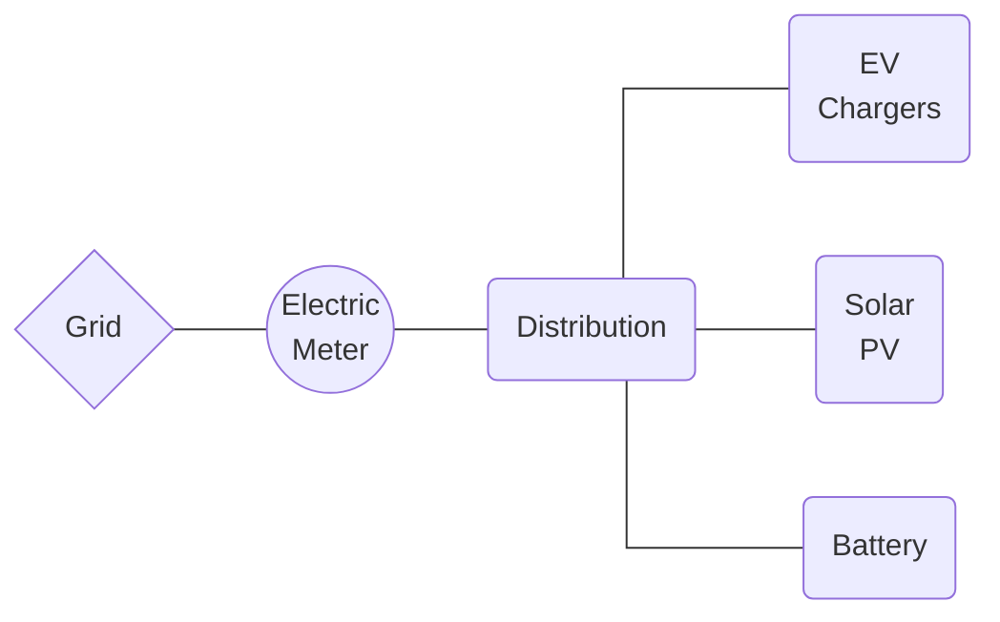
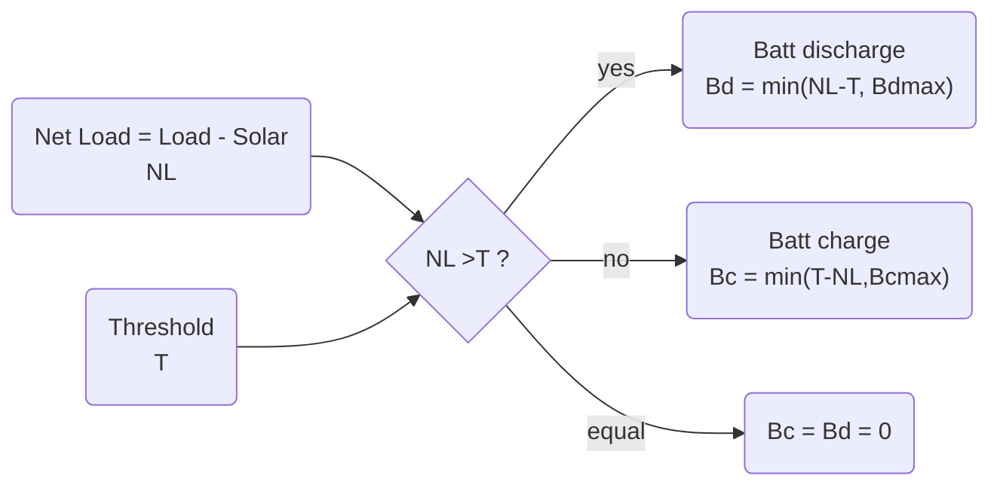
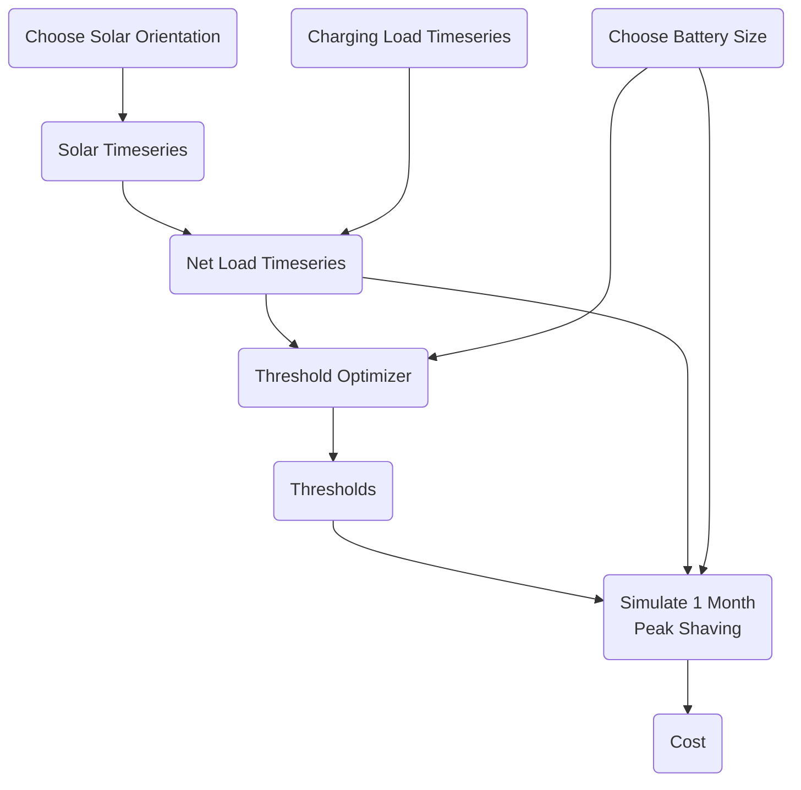

# Abstract

--

# Introduction

## Why peak load

The renewable energy transition will oversee a global shift toward electric energy consumption and renewable electric energy production in the coming decades. Since most electric transmission and distribution networks were previously built slowly over the span of many decades, electric load growth will almost definitely outpace network upgrades. And where these upgrades are completed they are necessarily an additional cost paid by all electricity consumers, due to the decrease in the load factor. Furthermore in some markets where companies can own both generation and distribution, business-as-usual infrastructure upgrades may be prioritized over the new construction of more complex and financially risky renewable generators. So while there are some creative solutions around dynamic capacity limits, two important solution areas for overall deployment speed, cost effectiveness, and overall decarbonization goals are (a) more local energy production and (b) increasing the load factor.

Electric vehicle (EV) charging and electric heating and cooling, including traditional air conditioning and heat pumps, are two common new loads that will strain networks in most countries. Heat pump and air conditioning load factor may be increased with architectural features such as insulation and thermal storage, but building retrofits are often slowed down due to permitting and other challenges. Meanwhile extreme weather events, especially heat waves, will likely further reduce the load factor of these devices. Many EV users will choose to slowly charge overnight at home for convenience and to minimize their energy cost. However workplace, fleet, and public EV charging stations will likely still be required, and these may especially suffer from a low load factor due to the convenience or need of fast charging at high power. 

## Peak shaving

Peak load management, or peak shaving, essentially requires choosing a power threshold and holding the load power below it. Controllable loads, energy storage, or generation assets behind the billing meter can all be used to reduce the load power to the threshold power. The threshold may only apply for only certain time periods. There may be multiple thresholds and periods each day, month, or year. There are two general cases of peak shaving worth considering. The most generation formulation of peak shaving control is formulated in Equation 1.
$$
(1)\ I_{load,t} - \Sigma_i I_{gen,i,t} - \Sigma_j I_{gen\uarr,j,t} - \Sigma_k I_{load\darr,k,t} < I_{threshold,t} \\
\\
\text{where:} \\
i=\text{generation asset with no flexibility} \\
j=\text{generation asset with upward flexibility} \\
k=\text{controllable load asset with downward flexibility} \\
t=\text{relevant timesteps}
$$

Here we consider the case of no controllable load, a single battery, solar which reduces the site load, and all values in units of average real power over the interval $\Delta h = 1\ hour$. 
$$
(2)\ P_{load,h} - P_{solar,h} - P_{batt,discharge,h} + P_{batt,charge,h}  < P_{threshold,h} \\
\\
\text{where:} \\
P_{batt,discharge,h} \ge 0 \\
P_{batt,charge,h} \le 0 \\
h \in \{0,1,2,...23\} \\
$$

## Technical case

Technical peak shaving refers to the case where a load must operate under a technical limitation such as a maximum power agreement or distribution transformer size. The load power must remain under the threshold at all times, otherwise there may be a technical failure such an activated overcurrent protection. Even if the load is technically able to rise above the threshold, doing so may violate a contract regarding maximum load power. The important consideration is that the economic cost of failure to hold the load under the threshold is prohibitively high. The time resolution of technical peak shaving control and modeling may need to be as low as seconds or milliseconds. Although this may be a challenging problem if the current limit is dynamically set or if a larger network is considered, from the perspective of dispatching the assets to shave the peak the problem is a relatively simple one: economic dispatch such that the the load current remains below the threshold current. Technical peak shaving might be performed on current or apparent power rather than active power.

> *Figure A: The threshold is 20 kW. The battery begins the day full at 100 kWh. By 8:00 the load has increased above the threshold to 25 kW, but solar has also increased to 9 kW, so the site load is still below the threshold. However at 9:00 the battery must discharge at 13 kW to reduce to site load to 20 kW. At 12:00 the battery can recharge somewhat due to an increase in solar and slight decrease in load. Then by 18:00 the load is less than the threshold and the battery can recharge, increasing the site load up to the threshold.*

An example of technical peak shaving with a threshold of 20 kW is seen in Figure A. The actual load climbs well above the threshold, but the solar energy for that day reduces the site load considerably. Battery discharge is required in the morning and afternoon to keep the site load below the threshold, with some opportunistic midday charging. The battery recharges in the evening and overnight.   

## Economic case

Rather, economic peak shaving aims to reduce what a consumer pays for power and possibly also energy. Medium and large electric consumers often pay a price on energy (€$/kWh$) and a price on power (€$/kWh_{peak}$), or demand charge. The energy cost (€$/kWh \times E_{consumed}$) may vary with time of day, day of week, and season of the year, which is often referred to as time of use or peak pricing. Where there is a sufficient spread between the peak and off-peak prices there may be the opportunity to curtail load during high prices, use controllable loads to shift from a high price period to a lower one, or to use energy storage to buy energy at the lower price and reduce load during a higher price period. A peak shaving approach applied to the energy cost could be effective and maybe even advantageous. However there are several key differences between an energy based approach and a power one, where peak shaving is better suited for the latter.

Instead, the power cost (€$/kW \times P_{max}$ ) typically applies to the max power during the billing period, where the peak power is the maximum non-moving average in a given period (e.g. 12:00-18:00 on weekdays) calculated on a given interval (e.g. 60 minutes). Similar to the energy cost, there may be multiple time of use periods and associated prices, such as peak, mid-peak, and off-peak. And where the spread price is sufficiently high, the period peak can be reduced with load curtailment or rescheduling, distributed generation such as solar, or energy storage.     

> *Figure B: The threshold is comprised of two parts: Threshold0 at 20 kW from 12:00-18:00, and Threshold1 at 40 kW from 9:00-12:00 and 18:00-21:00. The battery begins the day full at 100 kWh. By 9:00 the load has increased above Threshold0, solar decreases this greatly, and the battery is discharged to further reduce the site load. However at 9:00 the battery must discharge at 13 kW to reduce to site load to 20 kW. At 11:00 and 12:00 the battery can recharge somewhat due to an increase in solar and slight decrease in load. Then by 18:00 the load is significantly less than the threshold and the battery can recharge, increasing the site load up to the threshold.*

Solar contributes significantly to the load, but once the peak period begins the battery must discharge to keep the 

| Feature                         | Technical Peak Shaving | Economic Peak Shaving          |
| ------------------------------- | ---------------------- | ------------------------------ |
| Cost of violating the threshold | Prohibitively high     | Depends on tariff              |
| Averaging interval              | << 1 minute            | 15 minutes or 1 hour (typical) |
| Valid times of day              | All                    | Limited (e.g. 16:00 to 21:00)  |
| Peak is reset every..           | Never                  | Month, year, day (typical)     |

# Methodology

> *Figure E: Simplified one-line schematic of the simulated EV charging station with true measured EV charging power, modelled on-site solar PV generation, and a modelled stationary battery for economic peak shaving.*

The methodology of this study is a set of offline simulations involving (a) EV charging power measurements, (b) modelled solar PV production power, and (b) AC-coupled battery dispatch, all behind the retail electric meter. In each simulation the battery power is chosen such that the net load (natural load less solar production) is held below a given threshold, which is optimally chosen by a gradient descent optimizer. The optimal threshold changes for each TOU period. A single simulation is defined for one solar configuration and battery capacity and lasts one calendar month, which is the shortest period for which the cost function is defined. Simulations are repeated for several months of data, and many different solar and battery design sizes, allowing for a retail energy cost comparison among different design scenarios. EV charging power or solar are never curtailed. The primary decision variables in each timestep are (a) battery charge or discharge, and (b) battery power.

## Data

### EV Charging Load

The measured EV charging power ("load") is from the Caltech Adaptive Charging Network database at the JPL site. Each charging session provides timeseries active power, averaged over a 10 second interval. In the cases when complete timeseries data is not available for a session, the charging profile is estimated and the total charging energy delivered is the same. The disaggrated session timeseries data is summed into a single timeseries of total site charging power, which is then averaged over 15-minute intervals. Timestamp indices refer to the beginning of the 15-minute interval. The data period is from 2018-5-1 00:00 to 2019-2-28 23:45.

### Solar Production

The modelled PV production power begins life as GOES satellite solar irradiance data from the US National Solar Resource Database (NSRDB), and is specific to the exact time and date rather as opposed to typical meteorological year data. Prism Solar 350 bi-facial solar module DC electrical power is estimated using the California Energy Commission Performance Model, a 6-parameter physical PV cell model. The full AC array power is estimated given loss assumptions and an inverter efficiency lookup table in the NREL SAM database for the Enphase 390 W microinverter. All these functions are implemented in System Advisor Model v2022.11.21 (Gilman 2015). 

Three different solar array orientations are modelled and simulated in different case studies. Each orientation has the same number and type of modules: all modules facing South at 20° tilt, all modules facing West at 90° tilt, and half the modules facing South at 20° tilt and half the modules facing West at 90° tilt. Tilt is defined as 90° minus the altitude angle of the normal vector of the primary active face of the module. No shading is considered. Of the two sides of the bi-facial module, the primary active face is oriented West since afternoon load is generally subject to higher prices.

| Timeseries Description                                      | Location                                | Type                                                         | Interval / Length                                 | Total Energy / Solar Yield               | Source            |
| ----------------------------------------------------------- | --------------------------------------- | ------------------------------------------------------------ | ------------------------------------------------- | ---------------------------------------- | ----------------- |
| EV charging power ($kW_{ac}$)                          | Jet Propulsion Lab, Pasadena CA, USA    | Measured and aggregated from multiple EV chargers at single site | 10 sec (average downsampled to 15 min) / 304 days | 154.968 $MWh$ / --                       | Caltech ACN       |
| Solar irradiance  ($W/m^2$)                            | GPS: 34.2013, -118.1721 (2x2 km square) | GOES satellite irradiance                                    | 5 minute / 304 days                               | -- / --                                  | NSRDB PSMv3       |
| South 20° solar PV array production  ($kW_{ac}$)            | GPS: 34.2013, -118.1721 (2x2 km square) | Modelled from satellite irradiance, 368 modules facing south, tilt 20° | 15 minute / 304 days                              | 151.669 $MWh$ / 1180.8 $kWh \over kW_p$  | SAM (Gilman 2015) |
| West 90° solar PV array production  ($kW_{ac}$)             | GPS: 34.2013, -118.1721 (2x2 km square) | Modelled from satellite irradiance, 368 modules facing west, tilt 90° | 15 minute / 304 days                              | 130.925 $MWh$ / 1019.3 $kWh \over kW_p$  | SAM (Gilman 2015) |
| South 20° / West 90° solar PV array production  ($kW_{ac}$) | GPS: 34.2013, -118.1721 (2x2 km square) | Modelled from satellite irradiance, 184 modules facing south, tilt 20°, 184 modules facing west, tilt 90° | 15 minute / 304 days                              | 141.069 $MWh$ /  1098.2 $kWh \over kW_p$ | SAM (Gilman 2015) |

> *Table C: Timeseries Data Summary. EV charging power is measured every 10 seconds for 304 days at the Jet Propulsion Laboratory, CA, USA. Solar irradiance from the GOES satellite is acquired for the same location. Solar PV array production is modelled from the satellite irradiance using a 6 parameter PV cell model and inverter efficiency lookup table.*

## Battery

A stationary, storage battery system is simulated as the primary decision variable in the peak shaving algorithm. In each timestep the battery is chosen to charge or discharge within its technical limits. Because the control action is to hold the power exchange with the grid to below a certain threshold, batteries with a larger power capacity or energy capacity will necessarily achieve a lower threshold if the entire battery capacity is used. For a given energy capacity ($kWh$) those limits are a charge or discharge rate no more than 1C and SOC between 0 and 100% of rate. Charge and discharge efficiency is assumed constant and no self discharge or thermal limiting are considered.

There are many strategies for optimal battery sizing, but the emphasis in this work is instead on understanding the dynamics between load, shape of the solar curve, and peak shaving algorithm for a given battery size. Therefore a sensitivity analysis is performed on the battery energy capacity, but no one battery size is declared economically optimal.

| Battery Sizes (kWh)                      |
| ---------------------------------------- |
| 25, 50, 75, 100, 125, 150, 200, 400, 600 |

> *Table A: Vector of battery sizes chosen for peak shaving simulations. These were identified as interesting values experimentally.*

Each simulation assumed charge and discharge rate are limited to 1C, usable SOC is assumed 100%, and self discharge, parasitic losses, and thermal limiting are not considered.

## Electric Tariff

A typical California electric tariff is applied at the point of the retail electric meter, with several different TOU periods and prices. For the chosen tariff each TOU period may have an energy price ($\$/kWh$), a power price ($\$/kW$), or both. The prices may also change between seasons, and have long term trends like any retail electric prices. Here a price on power ("demand charge") is understood as a $\$/kW$ price applied to the monthly maximum power observed at the meter, calculated as the 15-minute average of real power. 

| TOU Name        | TOU Period                            | Summer [\$] Jun 1 - Sept 30 | Winter [\$] Oct 1 - Feb 28 | Spring [\$] Mar 1 - May 30 |
| --------------- | ------------------------------------- | -------------------------------- | ------------------------------- | ------------------------------- |
| All hours       | 0:00-0:00                             | 26.07 / kW                       | 26.07 / kW                      | 26.07 / kW                      |
| Super off-peak  | 9:00-14:00                            | --                               | --                              | 0.079 / kWh                     |
| Off-peak spring | 0:00-9:00, 14:00-16:00, 21:00-0:00 | --                               | --                              | 0.132 / kWh                     |
| Off-peak winter | 0:00-16:00, 21:00-0:00                | --                               | 0.132 / kWh                     | --                              |
| Off-peak summer | 0:00-14:00, 23:00-0:00                | 0.132 / kWh                      | --                              | --                              |
| Partial-peak    | 14:00-16:00, 21:00-23:00              | 6.81 / kW 0.159 / kWh       | --                              | --                              |
| Peak            | 16:00-21:00                           | 32.90 / kW 0.196 / kWh      | 2.22 / kW 0.172 / kWh      | 2.22 / kW 0.172 / kWh      |

> *Table B: Retail Electric Tariff. An applicable electric tariff schedule with seven different TOU periods for energy and power prices, varying by hours of the day and season of the year. From California PG&E.*

The total retail electric cost $C$ for each month is then the sum of the energy cost and power cost for the month, where the energy and power costs are calculated separately for each TOU period. The energy cost is the energy delivered to the site multiplied by the energy price for that TOU period. The power cost is the maximum 15-minute average power for the month multiplied by the power price for that TOU period.

$$
NL(t) = L(t) - S(t) \\
NL_{p}(t) = NL(t)\ \ \ \ \forall \ NL(t)>0 \\
(3)\ C_m = \Sigma_k^K [ p_{p,k,m} max(NL_{p,k,m}) + p_{e,k,m} \Sigma (NL_{p,k,m}) ] \\
\\
\text{where:} \\
C_m = \text{total retail electric cost for month}\ m\ (\$) \\
NL_p = \text{positive net load values}\ (kW) \\
p_{p,k,m} = \text{power price for TOU period}\ k\ \text{and month}\ m\  (\$/kW) \\
p_{e,k,m} = \text{energy price for TOU period}\ k\ \text{and month}\ m\ (\$/kWh) \\
K = \text{number of TOU periods}
$$

## Peak Shaving Algorithm

An optimal peak shaving strategy is used to minimized the total retail electric cost to the EV charging station. The strategy is operational only, and assumes the solar production timeseries and battery capacity are fixed. The state variable controlled by the algorithm is battery charge or discharge power. However the algorithm reframes the problem as one of choosing a power threshold $T\ (kW)$ applied to the point of injection to the grid, the electric meter. The battery is then dispatched, within its technical limits, to hold the net load (natural load less solar production) below the threshold. When the algorithm is successful the different thresholds for each TOU period are met for an entire month. If the battery reaches a technical limit and net load exceeds a threshold, the simulation is not necessarily invalid but is not likely to minimize the retail electric cost to the site for that combination of solar and battery size. The peak shaving logic is described in Figure D. 

> *Figure D: Peak shaving dispatch. Net load is the timeseries of load less solar. There is one threshold value for one for each TOU period with a non-zero power price. For each timestep of the simulation the net load is compared to the threshold of that TOU period, and the battery is discharged if the net load is greater than the threshold and charged if the net load is less than the threshold. If the two are equal the battery does nothing. For timesteps with no price on power the the battery does nothing.*

The peak shaving algorithm describes stepping through time and dispatching the battery according to power thresholds, but not how the thresholds are chosen. 

### Optimization

The optimal demand thresholds (one per TOU period) are determined by a custom gradient descent optimizer. The objective function $C$ minimizes the retail energy cost of one month, which is the billing interval of this retail electric tariff. In practice the optimal thresholds are different for each month. 

$$
min(C_m) \\
s.t. \\
B_c(t) \le B_{c,max} \forall t \\
B_d(t) \le B_{d,max} \forall t \\
SOC(t) \le SOC_{max} \forall t \\
SOC(t) \ge SOC_{min} \forall t \\
$$

Beginning from an initial guess the Newton-Raphson gradient descent optimizer calculates the batch gradient and updates parameters based on a learning rate of 0.01. This continues until the stopping condition is met, minimum cost for a patience of 50 iterations. The Newton-Raphson gradient descent based optimization method is preferred over linear programming because it will minimize over a variety of cost functions without needing to reformulate the linear program. More powerful optimizers such as evolutionary algorithms would also be effective.

## Simulations

# Case Studies

| Name                   | South 20°                                      | West 90°                                      | South 20° West 90°                                           |
| ---------------------- | ---------------------------------------------- | --------------------------------------------- | ------------------------------------------------------------ |
| Net zero sizing        | 368 bi-facial modules: azimuth=South, tilt=20° | 368 bi-facial modules: azimuth=West, tilt=90° | 184 bi-facial modules: azimuth=South, tilt=20° 184 bi-facial modules: azimuth=West, tilt=90° |
| Double net zero sizing | 736 bi-facial modules: azimuth=South, tilt=20° | 736 bi-facial modules: azimuth=West, tilt=90° | 368 bi-facial modules: azimuth=South, tilt=20° 368 bi-facial modules azimuth=West, tilt=90° |

> *Table D: Case Studies.*

# Results

The peak shaving methodology produces an optimally low power (demand) cost for each simulated month, and the monthly costs are summed up for a total power cost for the data available as in Figure A. First we notice that larger battery sizes (Figure A) and the larger solar plant size (Figure A vs Figure B) always reduces the power cost, as expected. 

The West 90 array achieves the lowest cost 

The West 90 and South 20 / West 90 cases always reduce the power cost relative to the baseline South 20 solar array, but the cost reduction decreases with larger battery sizes. And while the West 90 solar orientation always achieves lower cost than the hybrid South 20 / West 90 array, the difference is not substantial. The magnitude (USD) of cost reduction is the most important metric because it can be directly considered as revenue in a cashflow analysis to determine the economic performance of the combined solar and battery systems. 

***Figure A: Total power cost with peak shaving (net zero solar case).** The optimal peak shaving simulation finds a total cost for all data provided, which decreases with battery energy capacity. The West 90 and South 20 / West 90 cases always find a lower cost than the South 20 base case, although the reduction in cost decreases with larger battery size. The West 90 case always has a larger cost reduction than the South 20 / West 90, but the difference is not substantial and also decreases with larger battery size.* 

**Figure B: Total power cost with peak shaving (2x solar case).** The optimal peak shaving simulation is also applied to a case study with a solar array which is double the capacity of the net zero one. The total cost values are somewhat lower than the net zero solar case, although the decrease is far from proportional. More interesting however is that the much larger solar capacity brings the three cases much closer together in their total costs, which is to say that the West 90 and South 20 / West 90 arrays cases are not benefitting as much from the late afternoon solar production due to the much larger quantity of midday solar production.

| Battery Capacity (kWh) | South 20°  (Baseline) | West 90° | 50% South 20° 50% West 90° | West 90° Reduction | 50% South 20° 50% West 90°  Reduction | West 90° Reduction % | 50% South 20° 50% West 90°  Reduction % |
| ---------------------: | -------------------------: | -------: | ------------------------------: | ----------------------: | ----------------------------------------------: | -----------------------------: | ------------------------------------------------: |
|                     25 |                    29588.0 |  29221.0 |                         29133.0 |                   367.0 |                                           455.0 |                           1.24 |                                              1.53 |
|                     50 |                    23747.0 |  22972.0 |                         22876.0 |                   775.0 |                                           871.0 |                           3.26 |                                              3.66 |
|                     75 |                    19797.0 |  18721.0 |                         19058.0 |                  1076.0 |                                           739.0 |                           5.43 |                                              3.73 |
|                    100 |                    16230.0 |  15495.0 |                         15279.0 |                   735.0 |                                           951.0 |                           4.52 |                                              5.85 |
|                    125 |                    13388.0 |  12682.0 |                         12454.0 |                   706.0 |                                           934.0 |                           5.27 |                                              6.97 |
|                    150 |                    11155.0 |  11112.0 |                         10519.0 |                    43.0 |                                           636.0 |                           0.38 |                                              5.70 |
|                    200 |                     8445.0 |   8715.0 |                          8017.0 |                  -270.0 |                                           428.0 |                          -3.19 |                                              5.06 |
|                    400 |                     4850.0 |   5372.0 |                          5024.0 |                  -522.0 |                                          -174.0 |                         -10.76 |                                             -3.58 |
|                    600 |                     3694.0 |   4180.0 |                          3807.0 |                  -486.0 |                                          -113.0 |                         -13.15 |                                             -3.05 |

Table C: Battery size sensitivity analysis for each of the two solar configuration cases, standard rate tariff

| Solar Capacity (% of net zero) | Best s20->w90 Reduction [\$,%] (Batt [kWh]) | Best s20->s20w90 Reudction [\$,%] (Batt [kWh]) |
| ------------------------------ | ------------------------------------------ | --------------------------------------------- |
| 50%                            | 183, 0.6% (25)                             | 360, 1.1% (25)                                |
| 100%                           | 1076, 5.4% (75)                            | 951, 5.9% (100)                               |
| 125%                           | 1158, 7.0% (75)                            | 1091, 5.6% (75)                               |
| 150%                           | 1527, 7.9% (75)                            | 1281, 8.4% (100)                              |
| 175%                           | 1621, 13.5% (125)                          | 1668, 13.9% (125)                             |
| 200%                           | 1618, 13.9% (125)                          | 1656, 14.2% (125)                             |

Table D: Solar capacity sensitivity analysis fo

# Conclusion

# Bibliography
