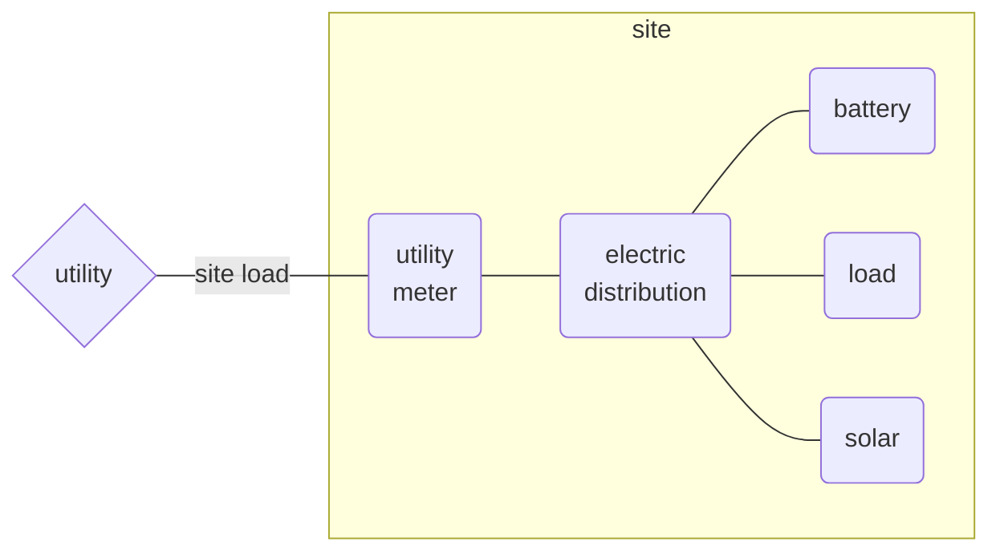
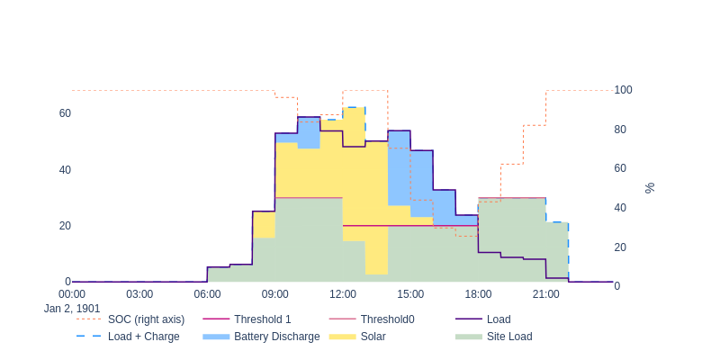
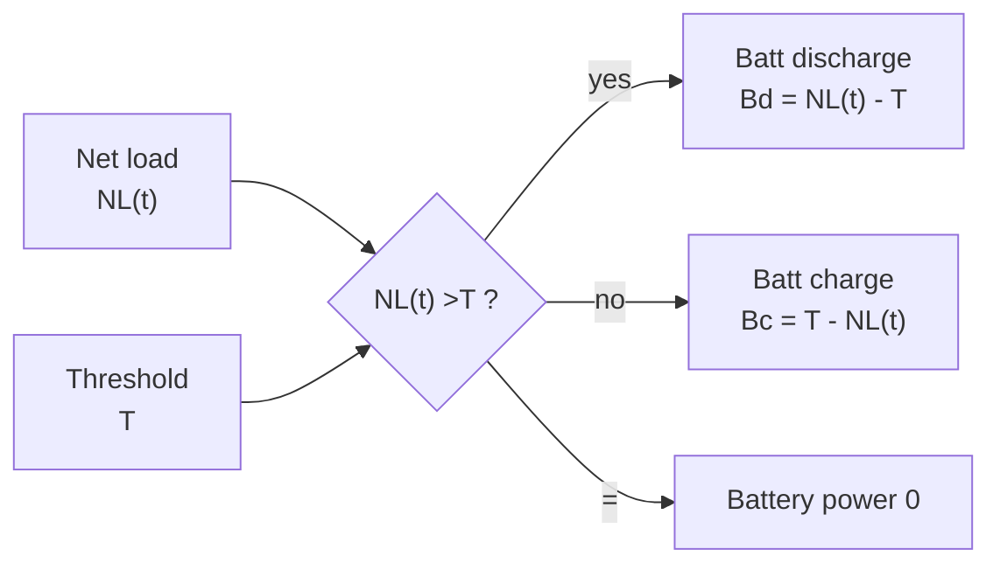
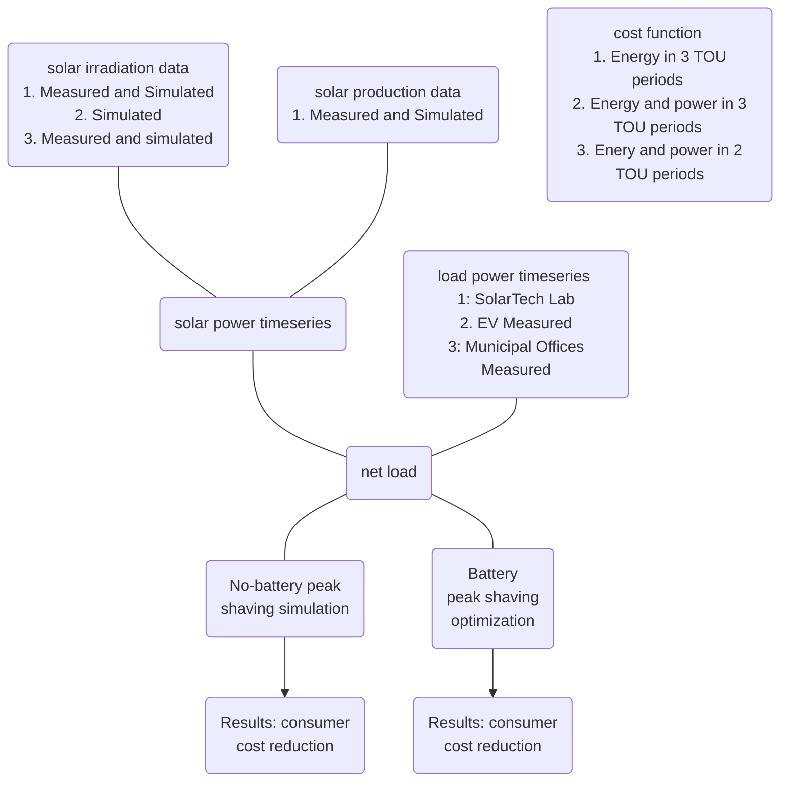
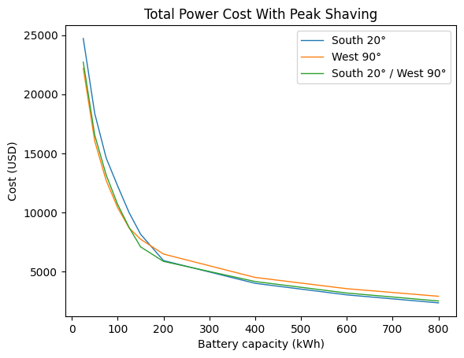

# Abstract

This work considers both distributed generation and peak shaving, and especially the dynamics between each in the specific example of distributed solar photovoltaic (PV) and battery peak shaving.

# Introduction

## Why peak load

The renewable energy transition will oversee a global shift toward electric energy consumption and renewable electric energy production in the coming decades. Since most electric transmission and distribution networks were previously built slowly over the span of many decades, electric load growth will almost definitely outpace network upgrades. And where these upgrades are completed they are necessarily an additional cost paid by all electricity consumers, due to the decrease in the load factor. Furthermore in some markets where companies can own both generation and distribution, business-as-usual infrastructure upgrades may be prioritized over the new construction of more complex and financially risky renewable generators. So while there are some creative solutions around dynamic capacity limits, two important solution areas for overall deployment speed, cost effectiveness, and overall decarbonization goals are (a) more local energy production and (b) increasing the load factor. 

Electric vehicle (EV) charging and electric heating and cooling, including traditional air conditioning and heat pumps, are two common new loads that will strain networks in most countries. Heat pump and air conditioning load factor may be increased with architectural features such as insulation and thermal storage, but building retrofits are often slowed down due to permitting and other challenges. Meanwhile extreme weather events, especially heat waves, will likely further reduce the load factor of these devices. Many EV users will choose to slowly charge overnight at home for convenience and to minimize their energy cost. However workplace, fleet, and public EV charging stations will likely still be required, and these may especially suffer from a low load factor due to the convenience or need of fast charging at high power. 

## Peak shaving

Peak load management, or peak shaving, essentially requires choosing a power threshold and holding the load power below it. Controllable loads, energy storage, or generation assets behind the billing meter can all be used to reduce the load power to the threshold power. The threshold may only apply for only certain time periods. There may be multiple thresholds and periods each day, month, or year. There are two general cases of peak shaving worth considering. The most generation formulation of peak shaving control is formulated in Equation 1.

*Figure C: General schematic of case studies. The site is connected to the electricity utility and pays for consumption according to the electric meter. Because solar is connected behind the meter it is directly useful for reducing the site load, and since it has a zero marginal cost it is always dispatched at maximum available power. The battery could be said to working on maintaining the net load below the peak shaving threshold, where net load is load less solar.*
$$
(1)\ I_{load,t} - \Sigma_i I_{gen,i,t} - \Sigma_j I_{gen\uarr,j,t} - \Sigma_k I_{load\darr,k,t} < I_{threshold,t} \\
where \\
i=generation\ asset\ with\ no\ flexibility \\
j=generation\ asset\ with\ upward\ flexibility \\
k=controllable\ load\ asset\ with\ downward\ flexibility \\
t=applicable\ timesteps
$$

Here we consider the case of no controllable load, a single battery, solar which reduces the site load, and all values in units of average real power over the interval $\Delta h = 1\ hour$. 

$$
(2)\ P_{load,h} - P_{solar,h} - P_{batt,discharge,h} + P_{batt,charge,h}  < P_{threshold,h} \\
where \\
P_{batt,discharge,h} \ge 0 \\
P_{batt,charge,h} \le 0 \\
h \in \{0,1,2,...23\} \\
$$

## Technical case

Technical peak shaving refers to the case where a load must operate under a technical limitation such as a maximum power agreement or distribution transformer size. The load power must remain under the threshold at all times, otherwise there may be a technical failure such an activated overcurrent protection. Even if the load is technically able to rise above the threshold, doing so may violate a contract regarding maximum load power. The important consideration is that the economic cost of failure to hold the load under the threshold is prohibitively high. The time resolution of technical peak shaving control and modeling may need to be as low as seconds or milliseconds. Although this may be a challenging problem if the current limit is dynamically set or if a larger network is considered, from the perspective of dispatching the assets to shave the peak the problem is a relatively simple one: economic dispatch such that the the load current remains below the threshold current. Technical peak shaving might be performed on current or apparent power rather than active power.

*Figure A: The threshold is 20 kW. The battery begins the day full at 100 kWh. By 8:00 the load has increased above the threshold to 25 kW, but solar has also increased to 9 kW, so the site load is still below the threshold. However at 9:00 the battery must discharge at 13 kW to reduce to site load to 20 kW. At 12:00 the battery can recharge somewhat due to an increase in solar and slight decrease in load. Then by 18:00 the load is less than the threshold and the battery can recharge, increasing the site load up to the threshold.*

An example of technical peak shaving with a threshold of 20 kW is seen in Figure A. The actual load climbs well above the threshold, but the solar energy for that day reduces the site load considerably. Battery discharge is required in the morning and afternoon to keep the site load below the threshold, with some opportunistic midday charging. The battery recharges in the evening and overnight.   

## Economic case

Rather, economic peak shaving aims to reduce what a consumer pays for power and possibly also energy. Medium and large electric consumers often pay a price on energy (€$/kWh$) and a price on power (€$/kWh_{peak}$), or demand charge. The energy cost (€$/kWh \times E_{consumed}$) may vary with time of day, day of week, and season of the year, which is often referred to as time of use or peak pricing. Where there is a sufficient spread between the peak and off-peak prices there may be the opportunity to curtail load during high prices, use controllable loads to shift from a high price period to a lower one, or to use energy storage to buy energy at the lower price and reduce load during a higher price period. A peak shaving approach applied to the energy cost could be effective and maybe even advantageous. However there are several key differences between an energy based approach and a power one, where peak shaving is better suited for the latter.

Instead, the power cost (€$/kW \times P_{max}$ ) typically applies to the max power during the billing period, where the peak power is the maximum non-moving average in a given period (e.g. 12:00-18:00 on weekdays) calculated on a given interval (e.g. 60 minutes). Similar to the energy cost, there may be multiple time of use periods and associated prices, such as peak, mid-peak, and off-peak. And where the spread price is sufficiently high, the period peak can be reduced with load curtailment or rescheduling, distributed generation such as solar, or energy storage.     

*Figure B: The threshold is comprised of two parts: Threshold0 at 20 kW from 12:00-18:00, and Threshold1 at 40 kW from 9:00-12:00 and 18:00-21:00. The battery begins the day full at 100 kWh. By 9:00 the load has increased above Threshold0, solar decreases this greatly, and the battery is discharged to further reduce the site load. However at 9:00 the battery must discharge at 13 kW to reduce to site load to 20 kW. At 11:00 and 12:00 the battery can recharge somewhat due to an increase in solar and slight decrease in load. Then by 18:00 the load is significantly less than the threshold and the battery can recharge, increasing the site load up to the threshold.*

Solar contributes significantly to the load, but once the peak period begins the battery must discharge to keep the 

| Feature                         | Technical Peak Shaving | Economic Peak Shaving          |
| ------------------------------- | ---------------------- | ------------------------------ |
| Cost of violating the threshold | Prohibitively high     | Depends on tariff              |
| Averaging interval              | << 1 minute            | 15 minutes or 1 hour (typical) |
| Valid times of day              | All                    | Limited (e.g. 16:00 to 21:00)  |
| Peak is reset every..           | Never                  | Month, year, day (typical)     |

# Methodology

The methodology of this study is an offline simulation of EV load power measurements and modelled solar PV production power. The true EV charging station has no co-located solar PV, but with some basic assumptions we calculate what the net load (true load less co-located solar PV) would be at the point of connection to the distribution grid: the electric meter. Then we apply a typical electric tariff which includes different prices for three different time-of-use (TOU) periods of the day. Each TOU period has both an energy price ($\$/kWh$) and power or demand price ($\$/kW$). Here a demand price is understood as a $\$/kW$ price applied to the monthly maximum power observed at the meter, calculated as the 15-minute average of real power. Since the solar data is modelled rather than measured we can consider different sizes of solar plants.

With the net load power timeseries built, we choose a battery capacity to use for the peak shaving simulations. There are many strategies for optimal battery sizing in this scenario, but in this work the emphasis is much more on understanding the benefit of different solar configurations for peak shaving using storage batteries. Therefore several different battery sizes are compared, but no single one is declared optimal.

In the last part of the methodology, an optimal peak shaving strategy is used to minimized the power cost to the EV charging station, given a certain solar PV configuration and a storage battery capacity. The strategy always assumes a net load threshold for each TOU period of the day. The battery will charge and discharge within its technical limits to maintain the net load under the threshold. Done successfully, the threshold is also the effective demand power of the month for that TOU period. If the battery power is limited by the technical limits and the net load exceeds a threshold, the peak shaving simulation is not necessarily invalid, but that simulation is not likely to represent a minimum cost.

Given the demand thresholds the dispatch simulation logic is simple, as in Figure D. 

*Figure D: Peak shaving dispatch. Net load is the timeseries of load less solar. There are three values of T, one for each TOU period. At any given time $t$ the net load is compared to the threshold, and the battery is discharged if the net load is greater than the threshold and charged if the net load is less than the threshold. If the two are equal the battery does nothing.*

The optimal demand thresholds (one per TOU period) are determined by an optimization. The thresholds are different for each month. The cost function of the optimization is simply the power cost incurred to the EV charging site in one month if the peak shaving dispatch strategy is followed with the given demand threshold. The optimization is performed in three steps:

1. A rough grid search calculates the cost at every permutation of threshold value from 0 kW to 100 kW, in increments of 10 kW (1331 objective function calls, 13 seconds)
   - Example: $Cost_{RGS}=\$900\ at\ T_{RGS}=(30,20,0)$
2. Beginning from the lowest cost thresholds of step 1, a fine grid search calculates the cost at every permutation of threshold from $T_{RGS} - 10 kW$ to $T_{RGS}+10kW$ in increments of 1 kW (1331 objective function calls, 13 seconds)
   - Example: $Cost_{FGS} = \$800\ at\ T_{FGS} = (29,26,1)$
3. Beginning from the lowest cost thresholds of step 2, a gradient descent optimizer modifies each of the three threshold values according to the gradient calculation and a learning rate (fixed at 0.01) until a stopping condition is met (typically 10-30 seconds)
   - Example: $Cost^* = \$700\ at\ T^* = (28.284,25.773,1.903)$

The Newton-Raphson gradient descent based optimization method is preferred over other linear programming because it does not require a strict mathematical problem formulation. With it we can solve for a month peak shaving simulation given any complex rate tariff with multiple and overlapping TOU prices, different prices for different days of week, and additional costs associated with daily or annual peaks. As long as the cost can be calculated, the optimal peak shaving thresholds can be discovered with this methodology if it can be shown to always converge to a global minimum. 

## Battery Sizing

The objective of this work is not to perform optimal sizing of the storage battery. However to understand the dynamics of the peak shaving algorithm it is helpful to perform a sensitivity analysis on the energy capacity of the battery, which here is done for several discrete sizes of battery which are in the table below. A simplifying assumption is that the power capacity (max kW) is determined from a max C-rate of 1C. 

| Battery Sizes (kWh)                      |
| ---------------------------------------- |
| 25, 50, 75, 100, 125, 150, 200, 400, 600 |

Exact alignment to commercially available battery sizes is not relevant, because the lack of standardization around energy and power capacity and the need of this study is only around sensitivity to change in capacity rather than precise a performance evaluation of a single battery and dispatch strategy.

## Data

The measured EV load power is from a database of EV charging session data, called the Caltech Adaptive Charging Network. Each charging session provides timeseries active power, averaged over a 10 second interval. In the cases when actual timeseries data is not available for a session, the charging profile is estimated but the total energy delivered is the same. Sessions are summed up for each timestep, providing the total charging station load averaged over 15 minute intervals.

The modelled PV production power begins life as GOES satellite solar irradiance data from the US National Solar Resource Database (NSRDB), and is unique to the exact time and date rather than being typical meteorological year data. Next the solar module power is estimated using the California Energy Commission Performance Model which is a 6-parameter physical PV cell model. Array power is estimated from an inverter efficiency lookup table in the NREL SAM database for the Enphase 390 W microinverter. All these functions are implemented in System Advisor Model v2022.11.21 (Gilman 2015). 

| Description                                | Location                                       | Type                                              | Interval                     | Min / Mean / Max | Source            |
| ------------------------------------------ | ---------------------------------------------- | ------------------------------------------------- | ---------------------------- | ---------------- | ----------------- |
| EV load power timeseries ($kW$)       | Jet Propulsion Lab Pasadena CA, USA       | Measured (14 months)                              | 10 sec (upsampled to 15 min) | 0 / ? / ?        | Caltech ACN       |
| Solar irradiance timeseries ($W/m^2$) | GPS: 34.2013, -118.1721 (2 x 2 km square) | Satellite (GOES)                                  | 5 minute                     |                  | NSRDB PSMv3       |
| Solar PV production timeseries ($kW$)      | --                                             | Modelled (368 Prism Solar 350 W bifacial modules) | 15 minute                    |                  | SAM (Gilman 2015) |

## Case Studies

| Name                   | South 20°                                      | West 90°                                      | South 20° West 90°                                           |
| ---------------------- | ---------------------------------------------- | --------------------------------------------- | ------------------------------------------------------------ |
| Net zero sizing        | 368 bi-facial modules: azimuth=South, tilt=20° | 368 bi-facial modules: azimuth=West, tilt=90° | 184 bi-facial modules: azimuth=South, tilt=20° 184 bi-facial modules: azimuth=West, tilt=90° |
| Double net zero sizing | 736 bi-facial modules: azimuth=South, tilt=20° | 736 bi-facial modules: azimuth=West, tilt=90° | 368 bi-facial modules: azimuth=South, tilt=20° 368 bi-facial modules azimuth=West, tilt=90° |

## Simulation

# Results

The peak shaving methodology produces an optimally low power (demand) cost for each simulated month, and the monthly costs are summed up for a total power cost for the data available as in Figure A. First we notice that larger battery sizes (Figure A) and the larger solar plant size (Figure A vs Figure B) always reduces the power cost, as expected. 

The West 90 array achieves the lowest cost 

The West 90 and South 20 / West 90 cases always reduce the power cost relative to the baseline South 20 solar array, but the cost reduction decreases with larger battery sizes. And while the West 90 solar orientation always achieves lower cost than the hybrid South 20 / West 90 array, the difference is not substantial. The magnitude (USD) of cost reduction is the most important metric because it can be directly considered as revenue in a cashflow analysis to determine the economic performance of the combined solar and battery systems. 

***Figure A: Total power cost with peak shaving (net zero solar case).** The optimal peak shaving simulation finds a total cost for all data provided, which decreases with battery energy capacity. The West 90 and South 20 / West 90 cases always find a lower cost than the South 20 base case, although the reduction in cost decreases with larger battery size. The West 90 case always has a larger cost reduction than the South 20 / West 90, but the difference is not substantial and also decreases with larger battery size.* 

**Figure B: Total power cost with peak shaving (2x solar case).** The optimal peak shaving simulation is also applied to a case study with a solar array which is double the capacity of the net zero one. The total cost values are somewhat lower than the net zero solar case, although the decrease is far from proportional. More interesting however is that the much larger solar capacity brings the three cases much closer together in their total costs, which is to say that the West 90 and South 20 / West 90 arrays cases are not benefitting as much from the late afternoon solar production due to the much larger quantity of midday solar production.

| Battery Capacity (kWh) | South 20°  (Baseline) | West 90° | 50% South 20° 50% West 90° | West 90° Reduction | 50% South 20° 50% West 90°  Reduction |
| ---------------------: | -------------------------: | -------: | ------------------------------: | ----------------------: | ----------------------------------------------- |
|                     25 |                    24720.0 |  22194.0 |                         22719.0 |                0.102184 | 0.080947                                        |
|                     50 |                    18375.0 |  16034.0 |                         16544.0 |                0.127401 | 0.099646                                        |
|                     75 |                    14601.0 |  12692.0 |                         13157.0 |                0.130744 | 0.098897                                        |
|                    100 |                    12232.0 |  10400.0 |                         10671.0 |                0.149771 | 0.127616                                        |
|                    125 |                     9979.0 |   8681.0 |                          8716.0 |                0.130073 | 0.126566                                        |
|                    150 |                     8151.0 |   7724.0 |                          7078.0 |                0.052386 | 0.131640                                        |
|                    200 |                     5915.0 |   6469.0 |                          5846.0 |               -0.093660 | 0.011665                                        |
|                    400 |                     3988.0 |   4487.0 |                          4142.0 |               -0.125125 | -0.038616                                       |
|                    600 |                     3010.0 |   3534.0 |                          3166.0 |               -0.174086 | -0.051827                                       |
|                    800 |                     2334.0 |   2892.0 |                          2494.0 |               -0.239075 | -0.068552                                       |

| Battery Capacity (kWh) | 2x South 20°  (Baseline) | 2x West 90° | 2x 50% South 20° 50% West 90° | 2x West 90° Reduction | 2x 50% South 20° 50% West 90°  Reduction |
| ---------------------: | ----------------------------: | ----------: | ---------------------------------: | -------------------------: | -------------------------------------------------- |
|                     25 |                       22791.0 |     19334.0 |                            20604.0 |                   0.151683 | 0.095959                                           |
|                     50 |                       16254.0 |     13044.0 |                            14155.0 |                   0.197490 | 0.129137                                           |
|                     75 |                       12553.0 |      9835.0 |                            10867.0 |                   0.216522 | 0.134311                                           |
|                    100 |                        9846.0 |      7374.0 |                             8223.0 |                   0.251066 | 0.164839                                           |
|                    125 |                        7764.0 |      5603.0 |                             6250.0 |                   0.278336 | 0.195003                                           |
|                    150 |                        6039.0 |      4250.0 |                             4711.0 |                   0.296241 | 0.219904                                           |

# Conclusion

# Bibliography
