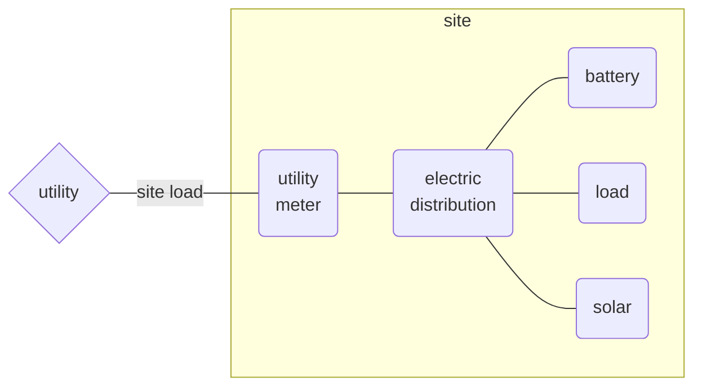
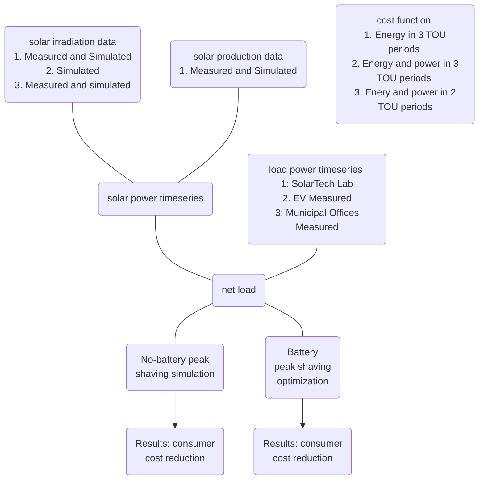

# Abstract

# Introduction

## Why peak load

The world right now requires a quick and efficient transition of most energy usage to electric and most energy production to renewable sources. With this changing energy paradigm will come a larger emphasis on peak load management. Electric load growth from equipment like EV charging and heat pumps will likely out pace distribution capacity growth in many areas. 

Public EV chargers may especially suffer from a low load factor due to the convenience of fast charging at high power. Heat pump load factor may be increased with architectural features such as insulation and thermal storage, but worsening extreme weather events and challenges to building efficiency retrofits will mean this can not be achieved everywhere. And relative to the marginal cost of additional kWh of energy, the marginal cost of additional kW of peak power is quite expensive because it necessarily requires new grid infrastructure like transformers and lines.

Distribution and transmission companies are well aware of this problem, but infrastructure upgrades are often slowed down by regulation and permitting. In regulatory areas where companies can own both generation and distribution, business-as-usual grid upgrades may be prioritized over construction of new renewable generation, which can often be complex projects with more difficult permitting and less certain returns. Largely due to these factors consumer prices on monthly and annual peak load are generally increasing around the world.

## Peak shaving

Peak load management, or peak shaving, essentially requires choosing a power threshold and holding the load power below it. Controllable loads, energy storage, or generation assets behind the billing meter can all be used to reduce the load power to the threshold power. The threshold may only apply for only certain time periods. There may be multiple thresholds and periods each day, month, or year. There are two general cases of peak shaving worth considering. The most generation formulation of peak shaving control is formulated in Equation 1.

*Figure C: General schematic of case studies. The site is connected to the electricity utility and pays for consumption according to the electric meter. Because solar is connected behind the meter it is directly useful for reducing the site load, and since it has a zero marginal cost it is always dispatched at maximum available power. The battery could be said to working on maintaining the net load below the peak shaving threshold, where net load is load less solar.*
$$
(1)\ I_{load,t} - \Sigma_i I_{gen,i,t} - \Sigma_j I_{gen\uarr,j,t} - \Sigma_k I_{load\darr,k,t} < I_{threshold,t} \\
where \\
i=generation\ asset\ with\ no\ flexibility \\
j=generation\ asset\ with\ upward\ flexibility \\
k=controllable\ load\ asset\ with\ downward\ flexibility \\
t=applicable\ timesteps
$$

Here we consider the case of no controllable load, a single battery, solar which reduces the site load, and all values in units of average real power over the interval $\Delta h = 1\ hour$. 

$$
(2)\ P_{load,h} - P_{solar,h} - P_{batt,discharge,h} + P_{batt,charge,h}  < P_{threshold,h} \\
where \\
P_{batt,discharge,h} \ge 0 \\
P_{batt,charge,h} \le 0 \\
h \in \{0,1,2,...23\} \\
$$

## Technical case

Technical peak shaving refers to the case where a load must operate under a technical limitation such as a maximum power agreement or distribution transformer size. The load power must remain under the threshold at all times, otherwise there may be a technical failure such an activated overcurrent protection. Even if the load is technically able to rise above the threshold, doing so may violate a contract regarding maximum load power. The important consideration is that the economic cost of failure to hold the load under the threshold is prohibitively high. The time resolution of technical peak shaving control and modeling may need to be as low as seconds or milliseconds. Although this may be a challenging problem if the current limit is dynamically set or if a larger network is considered, from the perspective of dispatching the assets to shave the peak the problem is a relatively simple one: economic dispatch such that the the load current remains below the threshold current. Technical peak shaving might be performed on current or apparent power rather than active power.

*Figure A: The threshold is 20 kW. The battery begins the day full at 100 kWh. By 8:00 the load has increased above the threshold to 25 kW, but solar has also increased to 9 kW, so the site load is still below the threshold. However at 9:00 the battery must discharge at 13 kW to reduce to site load to 20 kW. At 12:00 the battery can recharge somewhat due to an increase in solar and slight decrease in load. Then by 18:00 the load is less than the threshold and the battery can recharge, increasing the site load up to the threshold.*

An example of technical peak shaving with a threshold of 20 kW is seen in Figure A. The actual load climbs well above the threshold, but the solar energy for that day reduces the site load considerably. Battery discharge is required in the morning and afternoon to keep the site load below the threshold, with some opportunistic midday charging. The battery recharges in the evening and overnight.   

## Economic case

Rather, economic peak shaving aims to reduce what a consumer pays for power and possibly also energy. Medium and large electric consumers often pay a price on energy (€$/kWh$) and a price on power (€$/kWh_{peak}$), or demand charge. The energy cost (€$/kWh \times E_{consumed}$) may vary with time of day, day of week, and season of the year, which is often referred to as time of use or peak pricing. Where there is a sufficient spread between the peak and off-peak prices there may be the opportunity to curtail load during high prices, use controllable loads to shift from a high price period to a lower one, or to use energy storage to buy energy at the lower price and reduce load during a higher price period. A peak shaving approach applied to the energy cost could be effective and maybe even advantageous. However there are several key differences between an energy based approach and a power one, where peak shaving is better suited for the latter.

Instead, the power cost (€$/kW \times P_{max}$ ) typically applies to the max power during the billing period, where the peak power is the maximum non-moving average in a given period (e.g. 12:00-18:00 on weekdays) calculated on a given interval (e.g. 60 minutes). Similar to the energy cost, there may be multiple time of use periods and associated prices, such as peak, mid-peak, and off-peak. And where the spread price is sufficiently high, the period peak can be reduced with load curtailment or rescheduling, distributed generation such as solar, or energy storage.     

*Figure B: The threshold is comprised of two parts: Threshold0 at 20 kW from 12:00-18:00, and Threshold1 at 40 kW from 9:00-12:00 and 18:00-21:00. The battery begins the day full at 100 kWh. By 9:00 the load has increased above Threshold0, solar decreases this greatly, and the battery is discharged to further reduce the site load. However at 9:00 the battery must discharge at 13 kW to reduce to site load to 20 kW. At 11:00 and 12:00 the battery can recharge somewhat due to an increase in solar and slight decrease in load. Then by 18:00 the load is significantly less than the threshold and the battery can recharge, increasing the site load up to the threshold.*

Solar contributes significantly to the load, but once the peak period begins the battery must discharge to keep the 

| Feature                         | Technical Peak Shaving | Economic Peak Shaving          |
| ------------------------------- | ---------------------- | ------------------------------ |
| Cost of violating the threshold | Prohibitively high     | Depends on tariff              |
| Averaging interval              | << 1 minute            | 15 minutes or 1 hour (typical) |
| Valid times of day              | All                    | Limited (e.g. 16:00 to 21:00)  |
| Peak is reset every..           | Never                  | Month, year, day (typical)     |

# Methodology

# Results

# Conclusion

# Bibliography
