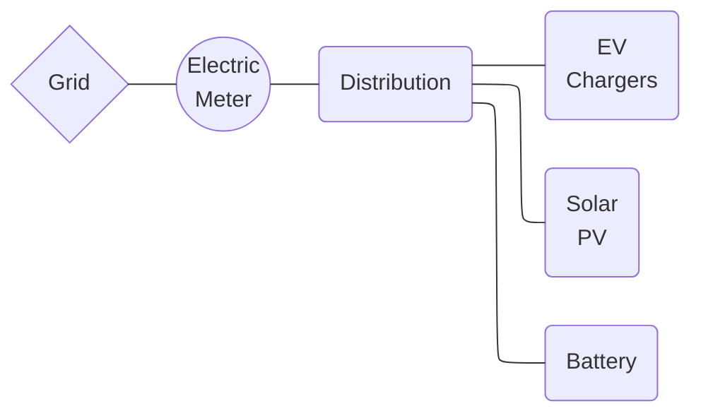
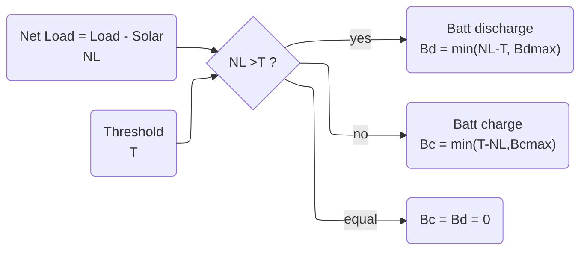
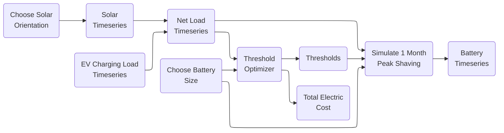

==DO NOT EXPORT TO .TEX==

# Abstract

Electric load peak shaving is a challenging and important problem considering the rapid growth of high power electric vehicle charging sites. Co-located solar photovoltaic provides locally produced energy, but an additional storage battery is required for reliable peak shaving. With occasional evening load peaks and an electric tariff with a 16:00-21:00 peak time of use period, vertical bifacial modules facing West have an economic advantage due to more of the production shifted into the late afternoon and early evening. Exploiting this, an optimal electric load peak shaving simulator dispatches a stationary battery to minimize the retail electric cost incurred by a real electric vehicle charging site over 10 months. Five different case studies of co-located bifacial solar photovoltaic arrays are simulated, a base case oriented South and tilted at 20° and four experimental cases where a percentage (25%, 50%, 75%, or 100%) of the array is oriented West and tilted at 90°. The problem is formulated such that the optimizer minimizes the retail electric cost by adjusting three peak power thresholds, each corresponding to a time of use period with an associated power price in $\$/kW$. The optimizer is implemented using a Newton-Raphson gradient descent approach and the optimality of the method is verified to within 0.1 $kW$. A sensitivity analysis on battery energy capacity results in a largest cost reduction, relative to the South 20° base case, of \$1422 (6.7%) achieved by the 50% West 90° case and a modest 25 kWh battery. A second sensitivity analysis on solar power capacity shows that the cost reduction increases monotonically and logarithmically for all cases and battery capacities. The largest cost decrease is \$2579 (16.1%), achieved by the 75% West 90° case at 200% of nominal solar capacity along with a 125 kWh battery. Both data and code are shared to the public on GitHub.

# Introduction

## Why peak load

The renewable energy transition will oversee a global shift toward electric energy consumption and renewable electric energy production in the coming decades. Since most electric transmission and distribution networks were previously built slowly over the span of many decades, electric load growth will almost definitely outpace network upgrades. And where these upgrades are completed they are necessarily an additional cost paid by all electricity consumers, due to the decrease in the load factor. Furthermore in some markets where companies can own both generation and distribution, business-as-usual infrastructure upgrades may be prioritized over the new construction of more complex and financially risky renewable generators. So while there are some creative solutions around dynamic capacity limits, two important solution areas for overall deployment speed, cost effectiveness, and overall decarbonization goals are (a) more local energy production and (b) increasing the load factor.

Electric vehicle (EV) charging and electric heating and cooling, including traditional air conditioning and heat pumps, are two common new loads that will strain networks in most countries. Heat pump and air conditioning load factor may be increased with architectural features such as insulation and thermal storage, but building retrofits are often slowed down due to permitting and other challenges. Meanwhile extreme weather events, especially heat waves, will likely further reduce the load factor of these devices. Many EV users will choose to slowly charge overnight at home for convenience and to minimize their energy cost. However workplace, fleet, and public EV charging stations will likely still be required, and these may especially suffer from a low load factor due to the convenience or need of fast charging at high power. 

## Peak shaving

Peak load management, or peak shaving, essentially requires choosing a power threshold and holding the load power below it. Controllable loads, energy storage, or generation assets behind the billing meter can all be used to reduce the load power to the threshold power. The threshold may only apply for only certain time periods. There may be multiple thresholds and periods each day, month, or year. There are two general cases of peak shaving worth considering. The most generation formulation of peak shaving control is formulated as:
$$
\begin{equation}
\begin{split}
I_{threshold,t} &> I_{j,t} - \Sigma_i I_{gen,i,t} - \Sigma_j I_{gen\uarr,j,t} - \Sigma_k I_{load\darr,k,t}  \\
\\
&\text{where:} \\
&i\text{ is generation asset with no flexibility} \\
&j\text{ is generation asset with upward flexibility} \\
&k\text{ is controllable load asset with downward flexibility} \\
&t\text{ is relevant timesteps}
\end{split}
\end{equation}
$$

Here we consider the case of no controllable load, a single battery, solar which reduces the site load, and all values in units of average real power over the interval $\Delta h = 1\ hour$. 
$$
\begin{equation}
\begin{split}
P_{threshold,h} &> P_{load,h} - P_{solar,h} - P_{batt,discharge,h} + P_{batt,charge,h}   \\
P_{batt,discharge,h} &\ge 0 \\
P_{batt,charge,h} &\le 0 \\
h &\in \{0,1,2,...23\} \\
\end{split}
\end{equation}
$$

### Technical

Technical peak shaving refers to the case where a load must operate under a technical limitation such as a maximum power agreement or distribution transformer size. The load power must remain under the threshold at all times, otherwise there may be a technical failure such an activated overcurrent protection. Even if the load is technically able to rise above the threshold, doing so may violate a contract regarding maximum load power. The important consideration is that the economic cost of failure to hold the load under the threshold is prohibitively high. The time resolution of technical peak shaving control and modeling may need to be as low as seconds or milliseconds. Although this may be a challenging problem if the current limit is dynamically set or if a larger network is considered, from the perspective of dispatching the assets to shave the peak the problem is a relatively simple one: economic dispatch such that the the load current remains below the threshold current. Technical peak shaving might be performed on current or apparent power rather than active power.

### Economic

Rather, economic peak shaving aims to reduce what a consumer pays for power and possibly also energy. Medium and large electric consumers often pay a price on energy (€$/kWh$) and a price on power (€$/kWh_{peak}$), also called a demand charge. The energy cost (€$/kWh \times E_{consumed}$) may vary with time of day, day of week, and season of the year, which is often referred to as time of use or peak pricing. Where there is a sufficient spread between the peak and off-peak prices there may be the opportunity to curtail load during high prices, use controllable loads to shift from a high price period to a lower one, or to use energy storage to buy energy at the lower price and reduce load during a higher price period. A peak shaving approach applied to the energy cost could be effective and maybe even advantageous. However there are several key differences between an energy based approach and a power one, where peak shaving is better suited for the latter.

Instead, the power cost (€$/kW \times P_{max}$ ) typically applies to the max power during the billing period, where the peak power is the maximum non-moving average in a given period (e.g. 12:00-18:00 on weekdays) calculated on a given interval (e.g. 60 minutes). Similar to the energy cost, there may be multiple time of use periods and associated prices, such as peak, mid-peak, and off-peak. And where the spread price is sufficiently high, the period peak can be reduced with load curtailment or rescheduling, distributed generation such as solar, or energy storage.     

| Feature                                | Technical Peak Shaving                    | Economic Peak Shaving             |
| -------------------------------------- | ----------------------------------------- | --------------------------------- |
| Consequence of exceeding the threshold | Damage to infrastructure, possible outage | Monetary cost depending on tariff |
| Averaging interval                     | << 1 minute                               | 15 minutes or 1 hour (typical)    |
| Valid times of day                     | All                                       | Limited (e.g. 16:00 to 21:00)     |
| Peak is reset every..                  | Never                                     | Month, year, day (typical)        |

# Methodology

> ***Figure E: Charging Site One Line Schematic.** Simplified one-line schematic of the simulated EV charging station with true measured EV charging power, modelled on-site solar generation, and a modelled stationary battery for economic peak shaving.*

The methodology of this study is a set of offline simulations involving (a) EV charging power measurements, (b) modelled solar photovoltaic (PV) production power, and (b) AC-coupled battery dispatch, all behind the retail electric meter. In each simulation the battery power is chosen such that the net load (natural load less solar production) is held below a given threshold, which is optimally chosen by a gradient descent optimizer. The optimal threshold changes for each time of use (TOU) period. A single simulation is defined for one solar configuration and battery capacity and lasts one calendar month, which is the shortest period for which the cost function is defined. Simulations are repeated for several months of data, and many different solar and battery design sizes, allowing for a retail energy cost comparison among different design scenarios. EV charging power or solar are never curtailed. The primary decision variables in each time step are (a) battery charge or discharge, and (b) battery power.

## Data

### EV Charging Load 

The measured EV charging power ("load") is from the Caltech Adaptive Charging Network database at the Jet Propulsion Lab (JPL) site. Each charging session provides time series active power, averaged over a 10 second interval. In the cases when complete time series data is not available for a session, the charging profile is estimated and the total charging energy delivered is the same. The disaggregated session time series data is summed into a single time series of total site charging power, which is then averaged over 15-minute intervals. Time stamp indices refer to the beginning of the 15-minute interval. The data period is from 2018-5-1 00:00 to 2019-2-28 23:45.

### Solar Production

The modelled PV production power begins life as Geostationary Operational Environmental Satellite (GOES) satellite solar irradiance data from the US National Solar Resource Database (NSRDB), and is specific to the exact time and date rather as opposed to typical meteorological year data. Prism Solar 350 W bifacial solar module DC electrical power is estimated using the California Energy Commission Performance Model, a 6-parameter physical PV cell model. The full AC array power is estimated given loss assumptions and an inverter efficiency lookup table in the US National Renewable Energy Laboratory (NREL) System Advisor Model (SAM) database for the Enphase IQH 380 W microinverter. All these functions are implemented in SAM v2022.11.21. 

Three different solar array orientations are modelled and simulated in different case studies. Each orientation has the same number and type of modules: all modules facing South at 20° tilt, all modules facing West at 90° tilt, and half the modules facing South at 20° tilt and half the modules facing West at 90° tilt. Tilt is defined as 90° minus the altitude angle of the normal vector of the primary active face of the module. No shading is considered. Of the two sides of the bi-facial module, the primary active face is oriented West since afternoon load is generally subject to higher prices.

| Timeseries Description             | Location                                | Type                                                         | Interval / Length                                  | Source            |
| ---------------------------------- | --------------------------------------- | ------------------------------------------------------------ | -------------------------------------------------- | ----------------- |
| EV charging power ($kW_{ac}$) | Jet Propulsion Lab, Pasadena CA, USA    | Measured and aggregated from multiple EV chargers at single site | 10 sec (average downsampled to 15 min) / 10 months | Caltech ACN       |
| Solar irradiance  ($W/m^2$)   | GPS: 34.2013, -118.1721 (2x2 km square) | GOES satellite irradiance                                    | 5 minute / 10 months                               | NSRDB PSMv3       |
| PV array production  ($kW_{ac}$)   | GPS: 34.2013, -118.1721 (2x2 km square) | Modelled from satellite irradiance, 368 Prism Solar 350 W bifacial modules, 368 Enphase IQH 380 W microinverters | 15 minute / 10 months                              | SAM (Gilman 2015) |

> ***Table C: Timeseries Data Summary.** EV charging power is measured every 10 seconds for 10 months at the Jet Propulsion Laboratory, CA, USA. Solar irradiance from the GOES satellite is acquired for the same location. Solar PV array production is modelled from the satellite irradiance using a 6 parameter PV cell model and inverter efficiency lookup table.*

## Battery

A stationary, storage battery system is simulated as the primary decision variable in the peak shaving algorithm. In each timestep the battery is chosen to charge or discharge within its technical limits. Because the control action is to hold the power exchange with the grid to below a certain threshold, batteries with a larger power capacity or energy capacity will necessarily achieve a lower threshold if the entire battery capacity is used. For a given energy capacity ($kWh$) those limits are a charge or discharge rate no more than 1C and state of charge (SOC) between 0 and 100% of rate. State of energy (SOE) is the SOC multiplied by nominal energy capacity and is used in plots because the units are more meaningful when comparing dispatch time series. Half-round-trip charge and discharge efficiency is constant at 90% and no self discharge or thermal limiting are considered.

There are many strategies for optimal battery sizing, but the emphasis in this work is instead on understanding the dynamics between load, shape of the solar curve, and peak shaving algorithm for a given battery size. Therefore a sensitivity analysis is performed on the battery energy capacity, but no one battery size is declared economically optimal.

| Battery Sizes (kWh)                      |
| ---------------------------------------- |
| 25, 50, 75, 100, 125, 150, 200, 400, 600 |

> ***Table A: Sensitivity on Battery Capacity.** Vector of battery sizes chosen for peak shaving simulations. These were identified as interesting values experimentally.*

Each simulation assumed charge and discharge rate are limited to 1C, usable SOC is assumed 100%, and self discharge, parasitic losses, and thermal limiting are not considered.

## Electric Tariff

A typical California electric tariff is applied at the point of the retail electric meter, with several different TOU periods and prices. For the chosen tariff each TOU period may have an energy price ($\$/kWh$), a power price ($\$/kW$), or both. The prices may also change between seasons, and have long term trends like any retail electric prices. Here a price on power ("demand charge") is understood as a $\$/kW$ price applied to the monthly maximum power observed at the meter, calculated as the 15-minute average of real power. 

| Name            | TOU Period                            | Summer (Jun 1 - Sept 30) [\$] | Winter (Oct 1 - Feb 28) [\$] | Spring (Mar 1 - May 30) [\$] |
| --------------- | ------------------------------------- | ---------------------------- | --------------------------- | --------------------------- |
| All hours       | 0:00-0:00                             | 26.07 / kW                   | 26.07 / kW                  | 26.07 / kW                  |
| Super off-peak  | 9:00-14:00                            | --                           | --                          | 0.079 / kWh                 |
| Off-peak spring | 0:00-9:00, 14:00-16:00, 21:00-0:00 | --                           | --                          | 0.132 / kWh                 |
| Off-peak winter | 0:00-16:00, 21:00-0:00                | --                           | 0.132 / kWh                 | --                          |
| Off-peak summer | 0:00-14:00, 23:00-0:00                | 0.132 / kWh                  | --                          | --                          |
| Partial-peak    | 14:00-16:00, 21:00-23:00              | 6.81 / kW, 0.159 / kWh  | --                          | --                          |
| Peak            | 16:00-21:00                           | 32.90 / kW, 0.196 / kWh | 2.22 / kW, 0.172 / kWh | 2.22 / kW ,0.172 / kWh |

> ***Table B: Retail Electric Tariff.** An applicable electric tariff schedule with seven different TOU periods for energy and power prices, varying by hours of the day and season of the year. From California PG&E.*

The total retail electric cost $C$ for each month is then the sum of the energy cost and power cost for the month, where the energy and power costs are calculated separately for each TOU period. The energy cost is the energy delivered to the site multiplied by the energy price for that TOU period. The power cost is the maximum 15-minute average power for the month multiplied by the power price for that TOU period. Only positive values of site load $SL$ are used in the cost calculation since the monthly peak power for each TOU period must always be positive and necessarily cannot benefit from net metering (export to the grid).

$$
\begin{equation}
\begin{split}
B(t) &= B_d(t) - B_c(t) \\
NL(t) &= L(t) - S(t) \\
SL(t) &= L(t) - S(t) - B(t) = NL(t) - B(t)\\
SL^+(t) &= SL(t),\ \forall\ SL(t)>0\\
C_m &= \Sigma_k^K [ p_{p,k,m} max(SL^+_{k,m}) + p_{e,k,m} \Sigma (SL^+_{k,m}) ] \\
\\
& \text{where:} \\
&L \text{ is EV charging load}\ [kW] \\
&S \text{ is solar production}\ [kW]\\
&NL \text{ is net load}\ [kW] \\
&SL \text{ is site load, measured at the retail electric meter}\ [kW] \\
&B_c \text{ is battery charging power (non-negative)}\ [kW] \\
&B_d \text{ is battery discharging power (non-negative)}\ [kW] \\
&C_m \text{ is total retail electric cost for month}\ m\ [\$] \\
&p_{p,k,m} \text{ is power price for TOU period}\ k\ \text{and month}\ m\  [\$/kW] \\
&p_{e,k,m} \text{ is energy price for TOU period}\ k\ \text{and month}\ m\ [\$/kWh] \\
&K \text{ is number of TOU periods}
\end{split}
\end{equation}
$$

## Peak Shaving Algorithm

An optimal peak shaving strategy is used to minimized the total retail electric cost to the EV charging station. The strategy is operational only, and assumes the solar production timeseries and battery capacity are fixed. The state variable controlled by the algorithm is battery charge or discharge power. However the algorithm reframes the problem as one of choosing a power threshold $T\ (kW)$ applied to the point of injection to the grid, the electric meter. The battery is then dispatched, within its technical limits, to hold the net load (natural load less solar production) below the threshold. When the algorithm is successful the different thresholds for each TOU period are met for an entire month. If the battery reaches a technical limit and net load exceeds a threshold, the simulation is not necessarily invalid but is not likely to minimize the retail electric cost to the site for that combination of solar and battery size. The peak shaving logic is described in Figure D. 

> ***Figure D: Peak Shaving Flowchart.** Net load is the timeseries of load less solar. There is one threshold value for one for each TOU period with a non-zero power price. For each timestep of the simulation the net load is compared to the threshold of that TOU period, and the battery is discharged if the net load is greater than the threshold and charged if the net load is less than the threshold. If the two are equal the battery does nothing. For timesteps with no price on power the the battery does nothing.*

The peak shaving algorithm describes stepping through time and dispatching the battery according to power thresholds, but not how the thresholds are chosen. 

## Threshold Optimizer

The optimal demand thresholds (one per TOU period) are determined by a custom gradient descent optimizer. The objective function $C$ minimizes the retail energy cost of one month, which is the billing interval of this retail electric tariff. In practice the optimal thresholds are different for each month. The threshold for each TOU period $T_k$ is not enforced to be non-negative, but in practice is always is because the cost function $C_m()$ cannot evaluate to a negative value.

$$
\begin{equation}
\begin{split}
min[C_m(B_c,B_d)] & = min[C_m(T_1,T_2,..T_K)] \\
& s.t. \\
B_c(t) & \le B_{c,max} \\
B_d(t) & \le B_{d,max} \\
SOC_{min} & \le SOC(t) \le SOC_{max} \\
\\
& \text{where:} \\
B_c & \text{ is battery charge power timeseries}\ [kW] \\
B_d & \text{ is battery discharge power timeseries}\ [kW] \\
T_k & \text{ is threshold for}\ k\text{-th TOU period of}\ K\ \text{total periods} \\
SOC & \text{ is battery state of charge timeseries}\ [\frac{kWh}{kWh}] \\
\end{split}
\end{equation}
$$

Beginning from an initial guess the Newton-Raphson gradient descent optimizer calculates the batch gradient and updates parameters based on a learning rate of 0.01. This continues until the stopping condition is met, minimum cost for a patience of 50 iterations. The Newton-Raphson gradient descent based optimization method is preferred over linear programming because it will minimize over a variety of cost functions without needing to reformulate the linear program. 

## Simulations

Simulations are run one month at a time for a given solar array orientation and battery capacity, according to the flowchart in Figure C. The computational environment is Python 3.8 in Windows 10 64-bit, on an Intel i9 CPU with 64 GB of RAM.

> ***Figure C: Simulation Flowchart.** Given a solar orientation and chosen battery capacity, the net load timeseries is calculated from EV charging load and solar production. The threshold optimizer produces one threshold value (kW) for each TOU period with non-zero power prices. This returns both optimal thresholds and a minimum cost. Lastly a 1 month simulation of the battery charging and discharging is performed to ensure no violations of the battery technical limits, and to produce the battery power timeseries for evaluation.*

# Case Studies

Five case studies are evaluated, each relating to the orientation of the solar array but not changing the overall $kW_{DC}$ capacity. All case studies use the Prism 350 W bifacial solar PV modules and the Enphase IQH 380 W microinverters. 

The first and baseline case is a South-facing array of 368 modules, tilted at 20˚. This is intended to be a typical rooftop solar plant, especially in northern latitudes where lower sun angles and winter snow make the research question of vertical bifacial modules even more relevant. The daily clearsky solar power curve is the familiar rounded triangle centered at solar noon. The array is sized such that the total energy produced is equal to the total energy consumption of the EV charging station. This "net zero" sizing is not necessarily economically optimal, but rather it is a reasonable or typical size solar plant for the load. 

The remaining case studies each consider a portion of the array to be instead rotated West and tilted 90°: 25%, 50%, 75%, and 100%. Especially the last case is relatively extreme from a design perspective, but should be investigated since it represents the maximum amount that the daily clear sky power curve can be pushed toward the morning and evening hours. This M-shaped power curve rather than the typical rounded-triangle power curve is the basis of any advantage vertical bifacial modules have regarding peak shaving. Micro inverters are used in the design so that the cases with part of the array facing west can be thought of a linear combination of the M-shaped and rounded-triangle power curves.

| Case Study    | No. Modules  | Orientation     | Tilt         | Total Energy  [$MWh$] | Solar Yield  [$\frac{kWh}{kW_{DC}}$] |
| ------------- | ------------ | --------------- | ------------ | -------------------------- | ----------------------------------------- |
| South 20°     | 368          | South           | 20°          | 151.7                      | 1180.8                                    |
| 25% West 90°  | 276 92  | South West | 20° 90° | 146.5                      | 1140.4                                    |
| 50% West 90°  | 184 184 | South West | 20° 90° | 141.1                      | 1098.2                                    |
| 75% West 90°  | 92 276  | South West | 20° 90° | 136.1                      | 1059.6                                    |
| 100% West 90° | 368          | West            | 90°          | 131.0                      | 1019.3                                    |

> ***Table D: Case Studies.** All modules are the Prism 350 W bifacial. The base case is South-facing array tilted to 20°. In the following four cases a percentage of the modules are oriented such that the primary high power module surface faces West and the modules are tilted to 90°: 25%, 50%, 75%, and 100%. As an increasing portion of the array is oriented West and vertical the total energy and solar yield decrease linearly as expected.*

# Results

The peak shaving methodology produces an optimally low retail electric cost for each of the 10 months of data, which are summed up for total electric cost in Figure A versus the battery capacity sensitivity analysis. The costs monotonically decrease with battery capacity as expected because every marginal unit of added battery energy capacity allows the algorithm to hold a power threshold for longer, and  since each battery is rated for 1C at charging and discharging, the battery will also have more power capacity to achieve lower thresholds relative to the same size peak. The 100% West 90° array achieves a lower total cost than the baseline South 20°. All three combination arrays achieve a lower cost for all battery capacities up to 200 kWh, with a maximum reduction of \$1422 (6.7%) relative to the South 20° with a 100 kWh battery. The largest percentage improvement of 7.10% (\$1208) occurs for the same array but 150 kWh battery. The absolute cost reduction is likely more important than the relative reduction since it would be treated directly as revenue in a cash flow analysis to determine the economic performance of a given battery.

>  ***Figure A: Total Retail Electric Cost and Percentage Reduction.** Left: Total Retail Electric Cost is calculated for each solar array case study and a sensitivity analysis is performed on battery capacity (kWh). Below 150 kW the South 20° and 100% West 90° arrays have similarly high total costs, whereas the three combination arrays are somewhat grouped a few percent below. Above 150 kW the total costs for each case diverge somewhat, with the South 20° base case attaining the lowest cost for the 400 kWh battery and larger. Right: Reduction in Total Retail Cost is likely the most important metric for evaluating the peak shaving efficacy, since it can be directly used as revenue in a cash flow analysis to calculate economic performance. The combination 50% West 90° array with 100 kWh battery achieve the largest cost reduction of \$1422 (6.7%) over the 10 month data period. A selection of the data generating these graphs is shown in Table C.* 

The benefit of vertical bifacial modules can be seen when comparing the simulated battery charge and discharge time series data. Figure F shows the same day (June 6) for both the base Solar 20° case and the 100% West 90° case, which is presented here as a clearer graphical example than the better performing 50% West 90° array. For both cases June 6 is the limiting day for the month, where the battery reaches a technical limit, in these cases zero SOC. This is likely due to a particularly large evening peak load event from approximately 17:30 to 21:30, with a maximum power of 56 kW and total energy of 201 kW. For these simulations the battery capacity is 125 kWh nominal and 112.5 kWh after losses, and as specified the battery will charge and discharge at a maximum of 1C or 125 kW. 

In Figure F the base case of South 20° overproduces in the middle hours of the day and solar is exported to the network starting around 12:00. During the peak load event the South 20° only produces 18.8 kWh whereas the 100% West 90° array produces 104 kWh. In each case the battery charges to 100% (125 kWh) before the evening peak load event. The result is that the evening net load peak in the 100% West 90° case starts later and contains less energy, though it reaches the same maximum power. Due to this the battery in the 100% West 90° case can hold the site load to a lower threshold in $kW$, which is directly proportional to reducing the retail electric cost. During the expensive "Peak" TOU period of 14:00-21:00 the base South 20° case only achieves a low threshold of 13.0 kW, whereas the 100% West 90° case holds a threshold of 3.1 kW in the same period, a 76% improvement.

The retail electric cost isn't defined for only one day out of a typical month, since the power portion of the cost is calculated on the monthly peak. However if June 6 was the only day of the month with non-zero load the total cost would be \$983 for the South 20° case and \$560 for the 50% West 90° case, which is a 43% reduction.

> ***Figure F: Single Day of Peak Shaving.** The stacked dispatch plots use a convention where EV charging load (magenta) and stationary battery charging additional load (blue) are the solid lines, whereas any source of energy including the discharging battery are solid areas. Since load must always be equal to the sum of supplied energy, the areas always stack up to meet the load lines. The only exception is when energy is exported back to the network, as is the case with afternoon solar production here. The TOU power thresholds are represented by the four dashed line segments, which begin and end based on the begin and end of the TOU period, and overlap in time where the TOU periods overlap. SOE is the dash-dot line referenced to the right vertical axis. LEFT: The base South 20° solar array overproduces midday and exports energy to the grid, leaving more energy in the evening peak that the stationary battery needs to serve. RIGHT: The 100% West 90° case exports less solar to the grid, and has more late afternoon production aligned with the evening load peak, allowing the peak shaving algorithm to achieve a 42% lower Peak period threshold of 7.7 kW than the South 20° array.* 

In Table C are some of the data from Figure A, though not shown for conciseness are the 75% West 90° and the 25% West 90° cases. The largest cost reduction is \$1422 for the 50% West 90° case and 100 kWh battery. Note that the largest reduction in retail cost may not be the best solution economically, since the 25 kWh battery achieves 65% of the cost reduction at 20% of the battery energy capacity, which is roughly proportional to capital cost.

| Battery [kWh] | Cost South 20° [\$] | Cost 50% West 90° [\$] | Cost 100% West 90° [\$] | Cost Reduction  50% West 90° [\$] | Cost Reduction 100% West 90° [\$] | Cost Reduction 50% West 90° [%] | Cost Reduction 100% West 90° [%] |
| ------------: | -----------------: | ------------------------------------: | ----------------: | ----------------------------------------------: | --------------------------: | ----------------------------------------------: | --------------------------: |
|            25 |            31314.0 |                               30391.0 |           31730.0 |                                           923.0 |                      -416.0 |                                             3.0 |                        -1.3 |
|            50 |            27132.0 |                               25773.0 |           27022.0 |                                          1359.0 |                       110.0 |                                             5.0 |                         0.4 |
|            75 |            23893.0 |                               22775.0 |           23625.0 |                                          1118.0 |                       268.0 |                                             4.7 |                         1.1 |
|           100 |            21229.0 |                               19807.0 |           20804.0 |                                      **1422.0** |                       425.0 |                                             6.7 |                         2.0 |
|           125 |            18954.0 |                               17623.0 |           18564.0 |                                          1331.0 |                       390.0 |                                             7.0 |                         2.1 |
|           150 |            17094.0 |                               15886.0 |           17286.0 |                                          1208.0 |                      -192.0 |                                             7.1 |                        -1.1 |
|           200 |            14547.0 |                               13689.0 |           15282.0 |                                           858.0 |                      -735.0 |                                             5.9 |                        -5.0 |
|           400 |            10730.0 |                               10969.0 |           12131.0 |                                          -239.0 |                     -1401.0 |                                            -2.2 |                       -13.1 |
|           600 |             8859.0 |                                9140.0 |           10333.0 |                                          -281.0 |                     -1474.0 |                                            -3.2 |                       -16.6 |

>  ***Table C: Total Retail Electric Cost.** Simulated total retail electric cost for three of the case studies (some omitted for conciseness) over the 10 months of available data and a given battery capacity. Cost reduction is calculated with respect to the South 20° base case. The best reduction in total retail cost is \$1422 for the 50% West 90° case.* 

A sensitivity analysis on the size of the solar array is performed with the results in Table D. The total retail cost decreases monotonically with the larger solar capacities, and the cost reduction increases by a factor of 10 from the smallest to largest solar capacity. This result is expected since the larger capacities create a more pronounced difference between the late afternoon production of the two arrays which the peak shaving strategy translates into lower power thresholds for the cases with some portion of the array in the 100% West 90° orientation. 

The 50% West 90° case performs best in the first four solar capacities at which point, for the first time, the best performing case is one where the majority of the modules are in the 100% West 90° orientation (75%). However the difference of \$19 is not substantial. At larger solar capacities the cost reductions for each case study are both larger in magnitude and closer together, however the increase in cost reduction is clearly less than linear with solar capacity. This suggests a diminishing returns problem where, after a certain capacity of 100% West 90° modules is met, the additional South 20° and 100% West 90° modules are providing energy when the battery is already at 100% SOC.  

| Solar Capacity [$kW_{DC}$] | Best Case for Cost Reduction | Best Cost Reduction [\$] | Best Cost Reduction Battery Capacity [kWh] |
| -------------------------- | ---------------------------- | ------------------------ | ------------------------------------------ |
| 64.4 (0.5x)                | 50% West 90°                 | 260                      | 25                                         |
| 128.8 (1.0x)               | 50% West 90°                 | 1422                     | 100                                        |
| 193.2 (1.5x)               | 50% West 90°                 | 2211                     | 125                                        |
| 257.6 (2.0x)               | 75% West 90°                 | 2579                     | 125                                        |

> Table D: Solar capacity sensitivity analysis based on reduction in total retail cost relative to the base South 20° case. While the 50% West 90° array continues to achieve the highest cost reduction, the battery capacity increases from 25 kWh to 125 kWh. 

> ***Figure G: Solar Capacity Sensitivity.** A sensitivity analysis on solar capacity shows more available cost reduction, which increases less than linearly with solar capacity.*

The battery capacities increase from 25 kWh up to 125 kWh across the solar sizes, which is an unexpected finding. Despite the extra capacity the 100% West 90° case in Figure H is still mostly unable to affect the peak power of the evening peaks, and thus both the base South 20° and combination array cases have a similar maximum power to shave. Indeed the average of the monthly peak net load values is 74.5 kW for the South 20° 2.0x case and 74.7 kW for the 100% West 90° 2.0x case. However, when increasing the solar to 2.0x, the energy under the net load time series during the 17:00 to 22:00 period decreases by only 164 kWh for the South 20° versus 886 kWh for the 100% West 90° case. With more solar production in the evening peak the optimizer is able to pursue driving the "Peak" TOU period to zero, which has a large economic benefit. This is unachievable with the small battery capacities and is more difficult without the late afternoon solar production of the 100% West 90° modules. Indeed a large 200 kWh battery is required to achieve the first 0 kW "Peak" period threshold in the South 20° case for all solar capacities. Rather, the 100% West 90° case achieves a 0 kW Peak period threshold with the 150 kWh battery at 100% solar capacity and with the 125 kWh battery at 2.0x solar capacity. 

> ***Figure H: Weekly Overlaid Load and Solar Power.** The entire 10 month time series of EV charging load, Solar 20°, and 100% West 90° are superimposed on a weekly basis, beginning on Monday. The 100% West 90° case provides a clearer graphical example than the better performing cases.* 

# Conclusion

An optimal electric load peak shaving strategy is simulated on 10 months of EV charging power time series. The peak shaving asset is a storage battery with a maximum charge and discharge rate of 1C and a constant discharge and charge efficiency of 90%. A co-located solar array is included in the simulation to study the effects of typical South facing modules vs West facing vertical bifacial modules. Five different array orientations are presented as different case studies. In addition sensitivity analyses on battery energy capacity and solar array capacity provide information about the dynamics of the optimal peak shaving algorithm. The best performing case is designed with 50% of the array South facing tilted at 20° and 50% facing West at 90°, which achieved a reduction in the total retail cost of energy of \$1422 (6.7%) with a 25 kWh battery. The cost reduction is relative to the base case array with all the modules facing South and tilted at 20°. When solar is increased to twice the net-zero capacity the best performing case is 75% West 90° with a cost reduction of \$2579 (16.1%) with a 125 kWh battery. The best percentage cost reduction overall is 20.0%. Both data and code are shared to the public on GitHub.

Peak shaving a monthly peak power typically, depending on the load factor, results in dispatching the battery until its technical limits to achieve a minimum monthly peak power. Because the load, or net load after solar is dispatched, is often not very homogeneous there will be one limiting day where the battery is bound by its technical limits and the peak power of the month is set. The presence of this limiting day in the month simulation of Figure F does not guarantee a global minimum cost, but the lack of a limiting day would suggest the global minimum was not found. Intuitively the limiting day can be thought of as the most difficult day for the battery to achieve the given thresholds, and if the day was somehow easier for the battery (less and more uniform net load) the power thresholds could be lowered and therefore a lower retail electric cost achieved. Because the results of each month typically depend strongly on one limiting day, small changes in the load or solar magnitude or temporal relationship can have a large impact on the overall results. For this reason peak shaving simulations require particular care into data selection, cleaning, and acquiring an appropriate large amount of data such that the probability space of true possible limiting is well represented in the selected sample of limiting days.

Confidence in the results presented is medium-high given the use of true EV charging measurements, a robust Newton-Raphson gradient descent optimizer with verified optimality, a true electric tariff appropriate for the load site and solar data location, and sensitivity analyses performed on two variables. Future work should include a more load data sets with more months of data, a more comprehensive battery model, an operational version of the peak shaving strategy, and testing at the Politecnico di Milano M2GLab microgrid. 

# Bibliography
